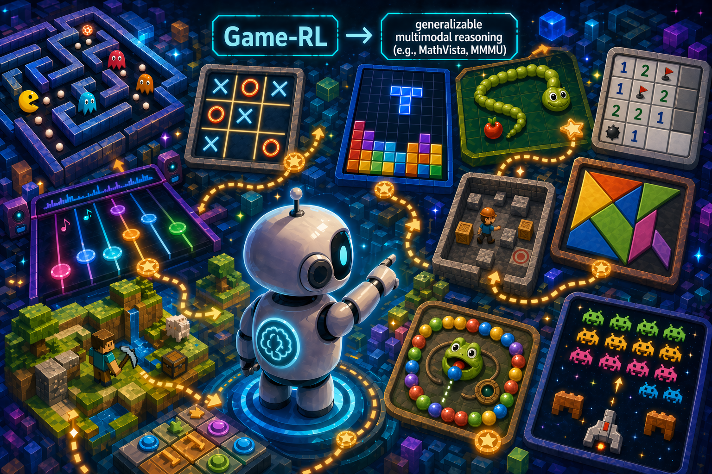
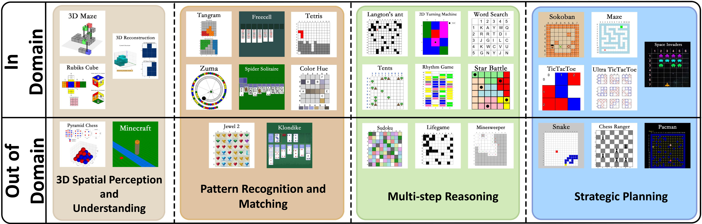
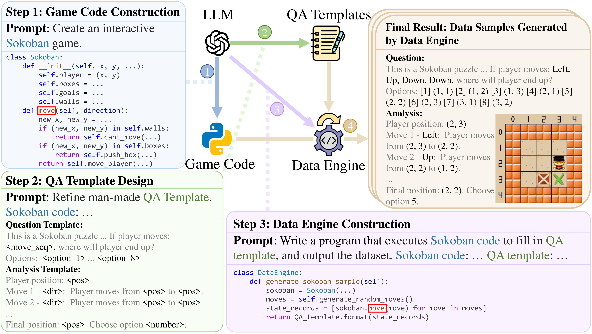
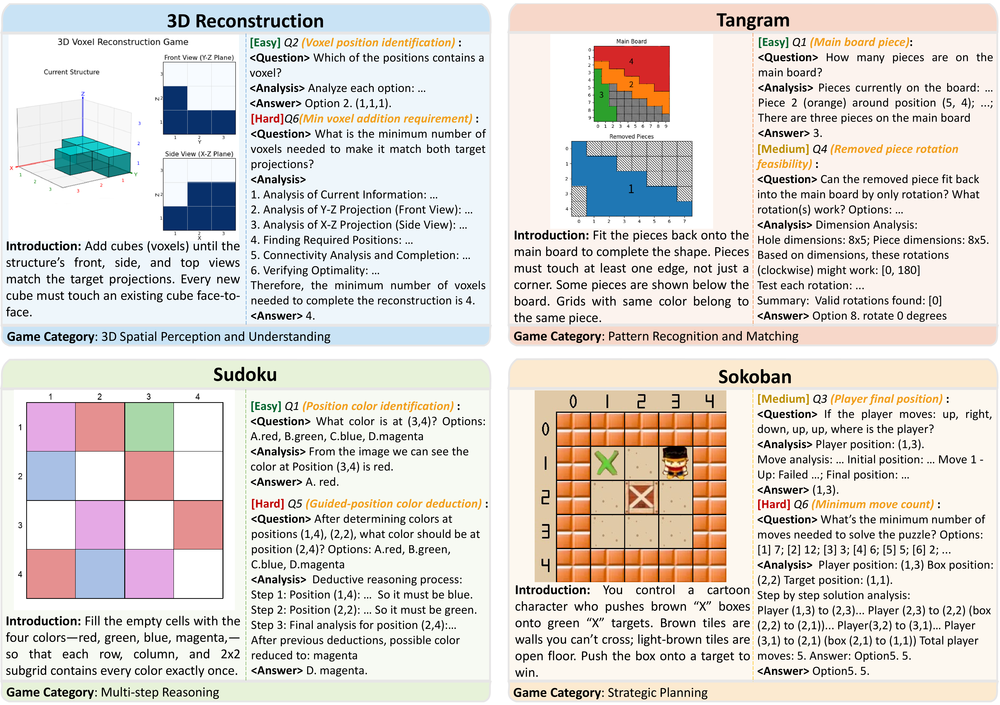
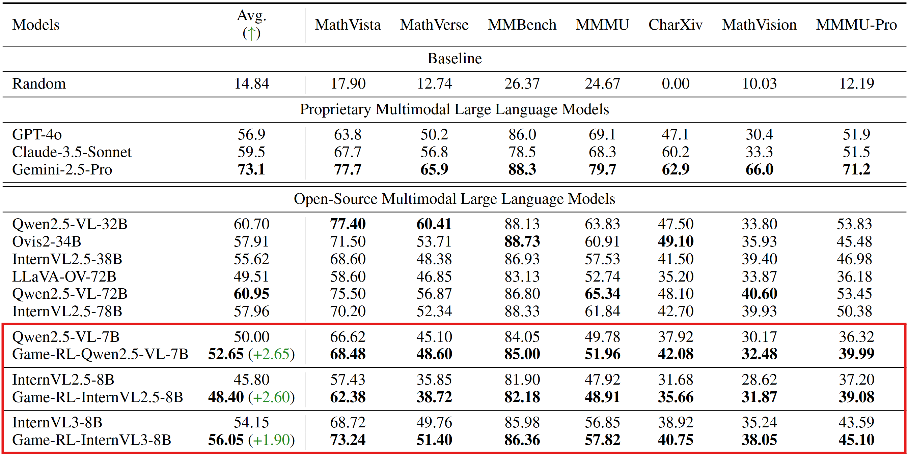
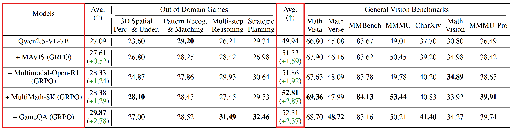
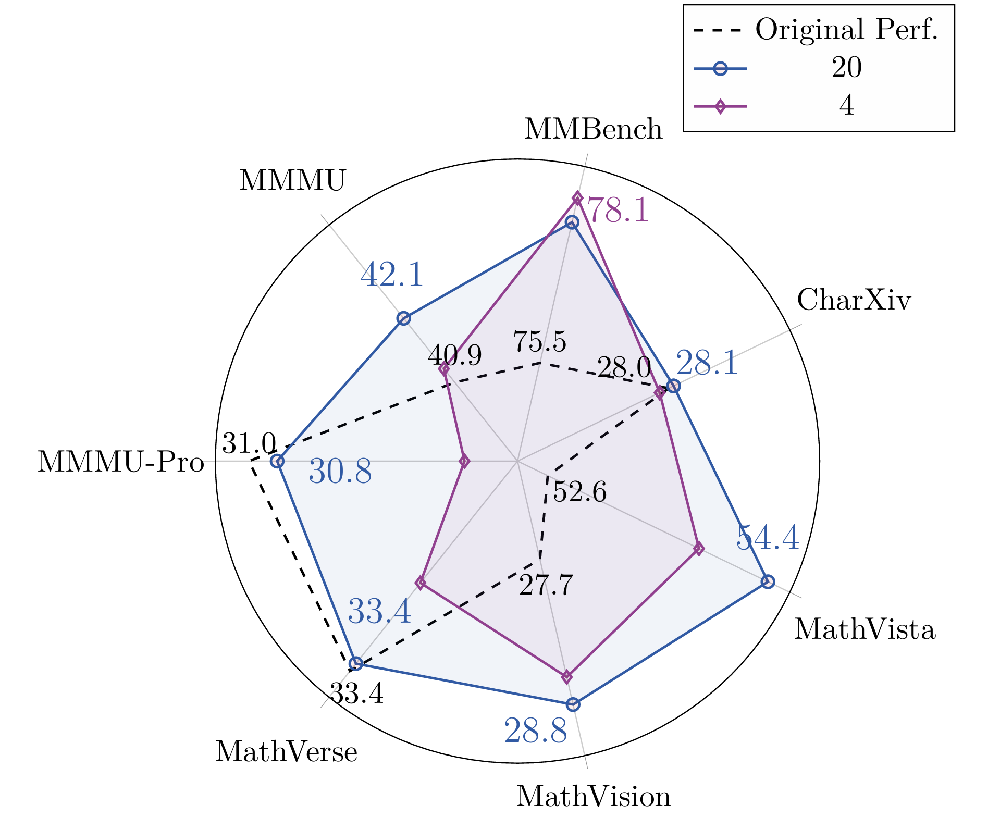
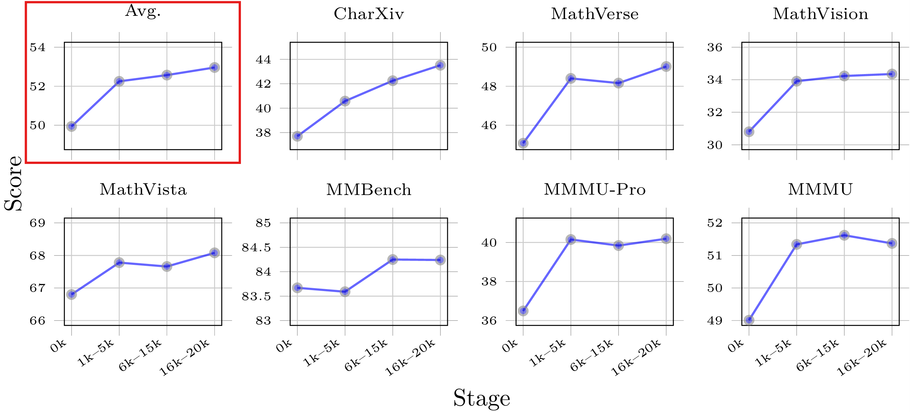

# [ICLR 2026] Game-RL: Synthesizing Multimodal Verifiable Game Data to Boost VLMs' General Reasoning

<div align=center></div>

Official repository for paper "[Game-RL: Synthesizing Multimodal Verifiable Game Data to Boost VLMs' General Reasoning](https://arxiv.org/abs/2505.13886)". This is the first work, to the best of our knowledge, that adapts game code to synthesize **multimodal game data** for ***training*** VLMs. When we apply **Game-RL**, which is simple GRPO on **GameQA** (synthesized via our **Code2Logic** approach), multiple cutting-edge open-source VLMs **exhibit out-of-domain generalization**. Remarkably, game data provides improvements comparable to general multimodal reasoning datasets (e.g. geometry/chart). More importantly, scaling up game diversity or game data volume consistently improves VLMs' generalizable reasoning capabilities. Our findings highlight scaling reinforcement learning in game environments as a promising direction for enhancing generalizable multimodal reasoning in foundation models.

[ [📖 Paper](https://openreview.net/pdf?id=e4FqU4SyHL) ] [ [🔗 Project Website](https://iclr26-game-rl.github.io/) ]

[[🤗 GameQA-140K Dataset](https://huggingface.co/datasets/OpenMOSS-Team/GameQA-140K) ] [[🤗 GameQA-5K Dataset](https://huggingface.co/datasets/OpenMOSS-Team/GameQA-5K) ] [[🤗 GameQA-text Dataset](https://huggingface.co/datasets/OpenMOSS-Team/GameQA-text) ]

[[🤗 Game-RL-InternVL3-8B Model](https://huggingface.co/OpenMOSS-Team/Game-RL-InternVL3-8B) ] [[🤗 Game-RL-InternVL2.5-8B Model](https://huggingface.co/OpenMOSS-Team/Game-RL-InternVL2.5-8B) ] [[🤗 Game-RL-Qwen2.5-VL-7B Model](https://huggingface.co/OpenMOSS-Team/Game-RL-Qwen2.5-VL-7B) ]

## 🎊 News

* [2026/04] 🔥**Princeton University** uses our GameQA dataset in their [Vero](https://github.com/zlab-princeton/vero) project.
* [2026/03] 🔥**National University of Singapore** uses our games in the [Gym-V](https://arxiv.org/pdf/2603.15432) platform.
* [2026/02] 🔥**Alibaba Group and Shanghai Jiao Tong University** use our GameQA-140K dataset at scale in the [DeepVision-103K](https://huggingface.co/datasets/skylenage/DeepVision-103K#%F0%9F%99%8F-acknowledgements) dataset, which accounts for around 50% of its "visual logic problems".
* [2026/01] 🔥**Shanghai AI Lab** uses our GameQA-140K dataset at scale in the [MMFineReason](https://mmfinereason.github.io/) dataset, which accounts for **87.65%** of its "Puzzle/Game" samples.
* [2026/01] 🔥**THUML and ByteDance Seed** use our Sokoban code for the synthesis of the Sokoban task samples in [VisWorld-Eval](https://thuml.github.io/Reasoning-Visual-World/) (and the training data).
* [2026/01] 🔥🔥*Our work has been accepted by* **ICLR 2026**! 🎉🎉🎉
* [2025/11] 🔥**DeepWisdom and Tsinghua University** use the maze-like games in our GameQA dataset in the [VR-Bench](https://github.com/FoundationAgents/VR-Bench) benchmark, which evaluates video models' reasoning.
* [2025/11] 🔥**Shanghai Innovation Institute** uses the games in our GameQA dataset for image editing reasoning tasks ("game-world scenarios"), developing the [UniREditBench](https://maplebb.github.io/UniREditBench/) benchmark and the [UniREdit-Data-100K](https://huggingface.co/datasets/maplebb/UniREdit-Data-100K) training data.

Please give us a star ⭐ if you find this work helpful.

<div align=center></div>

## 👀 Introduction

Vision-language reinforcement learning (RL) has primarily focused on narrow domains (e.g. geometry or chart reasoning). This leaves broader training scenarios and resources underexplored, limiting the exploration and learning of Vision Language Models (VLMs) through RL. We find video games inherently provide rich visual elements and mechanics that are easy to verify. To fully leverage the multimodal and verifiable rewards in video games, we propose Game-RL, constructing diverse game tasks for RL training to boost VLMs’ general reasoning ability. To obtain training data, we propose Code2Logic, a novel approach that adapts game code to synthesize reasoning data with unlimited examples and controllable difficulty gradation, thus obtaining the GameQA dataset of 30 games and 158 verifiable tasks. Remarkably, RL training solely on GameQA enables multiple VLMs to generalize across 7 diverse out-of-domain vision-language benchmarks, demonstrating the value of Game-RL for enhancing VLMs’ general reasoning. Furthermore, game data provides improvements comparable to general multimodal reasoning datasets (e.g. geometry/chart). More importantly, scaling up game diversity or game data volume consistently improves VLMs' generalizable reasoning capabilities. Our findings highlight scaling reinforcement learning in game environments as a promising direction for enhancing generalizable multimodal reasoning in foundation models.

### Code2Logic Approach

<div align=center></div>

The Code2Logic approach involves three main steps:
1. Using LLMs to construct game code of the selected game (*Sokoban*).
2. LLM-assisted design of the task templates including question and analysis templates based on the generated game code. Each task template condenses one type of reasoning pattern in the game.
3. Using LLMs to construct a data engine that directly reuses the core game code from the first step, including functions like `move`.
* After these main steps, the data engine is executed to fill in the task templates developed in Step 2 and generate data samples, as illustrated in the "Final Result" Section.

### GameQA Dataset

<div align=center></div>

Our GameQA dataset provides diverse verifiable game tasks along with controllable difficulty, extending RL training scenarios for VLMs to the domain of video games.
* It encompasses 30 different games classified into 4 categories based on the core capabilities required to solve game tasks.
* Four games from different categories and their example data samples are illustrated in the image above.
* The GameQA data samples are also reasonably graded by difficulty (see [🤗 GameQA-140K](https://huggingface.co/datasets/Gabriel166/GameQA-140K)).

### Key Findings

#### 😎 Game-RL leads to generalizable multimodal reasoning improvements

**RL Training solely on game data** (GameQA) enables three VLMs (Qwen2.5-VL, InternVL2.5, InternVL3) to achieve consistent performance improvements across 7 diverse vision reasoning benchmarks, **demonstrating strong out-of-domain generalization**. These results suggest that the models have successfully learned **transferable visual understanding and reasoning abilities** through Game-RL.

<div align=center></div>

#### 💪 Game data is competitive to geometry datasets 

Based on Qwen2.5-VL-7B, we applied the same training method on 5k GameQA samples, 8k samples from MAVIS, 8k Multimodal-Open-R1 samples, 8k MultiMath samples respectively, to conduct comparative training.

 **The GameQA-trained model is competitive compared to its counterparts trained on geometry or function data**, where general vision benchmarks would be considered in-domain. These results suggest that **GameQA enables stronger out-of-domain generalization**, even when using less data from a mismatched domain.

<div align=center></div>

#### 📈 Scaling Effects: Game Diversity & Data Volume

* **Game Diversity:** Scaling up game diversity (e.g., 4 games → 20 games) makes better generalization, enabling the model to acquire more robust visual understanding and reasoning abilities.

  <div align=center></div>

* **Data Volume:** Model's performance score demonstrates an overall upward trend on 7 general vision benchmarks as the amount of training data increases, indicating scaling up training game data volume effectively enhances the VLM's generalizable reasoning abilities.

  <div align=center></div>

## 🚀 How to Use

The following steps describe the training and evaluation workflow used in this repository. The shell scripts below are intended for a Linux environment with Bash, CUDA, and the corresponding Python dependencies installed. If you only want to generate game data samples, see the [Code for Generating GameQA Data](#-code-for-generating-gameqa-data) section below.

1.  **Clone the Repository**
    
    ```bash
    git clone https://github.com/tongjingqi/Game-RL.git
    cd Game-RL
    ```
    
2.  **Download the Dataset**
    Download the [🤗 GameQA-5K](https://huggingface.co/datasets/OpenMOSS-Team/GameQA-5K) dataset. Please ensure the dataset is placed in an appropriate location within the project, e.g., `Game-RL/data/GameQA-5K/`.

3.  **Setup Environment**
    
    ```bash
    # Install main dependencies 
    pip install vllm==0.7.3
    pip install flash-attn --no-build-isolation
    
    # Install ms-swift 
    cd ms-swift
    pip install -e .
    cd ..
    ```
    
4.  **Training and Evaluation**

    *   **Start the Reward Model**
        First, you need to start the reward model API. Execute the following in the `Game-RL` root directory:
        
        ```bash
        bash scripts/reward_api.sh
        ```
        Ensure this service starts successfully and runs in the background.
        
    *   **Start Training**
        After the reward model is running, you can begin training the Qwen2.5-VL model. Execute the following in the `Game-RL` root directory:
        
        ```bash
        bash scripts/train_qwen2_5vl.sh
        ```
        
    *   **Model Inference**
        Once training is complete, perform inference with your model to generate predictions. Execute the following in the `Game-RL` root directory:
        
        ```bash
        bash scripts/infer.sh
        ```
        This will typically output a JSON file containing the model's predictions.
        
    *   **Evaluate Results**
        Use the `eval.sh` script to evaluate the JSON file output by `infer.sh`. Execute the following in the `Game-RL` root directory:
        
        ```bash
        bash scripts/eval.sh path/to/your/inference_output.json
        ```
        *(Please replace `path/to/your/inference_output.json` with the actual path to your inference output file.)*
        
        **Note on Evaluation Model**: The evaluation in the paper follows the use of the `qwen2.5-72b-awq` model. You can also configure the script to use other evaluation APIs or models as needed.
        
        > *In our work, the inference and evaluation configurations were unified across both the original open-source models and our trained models.*

## 🎮 Code for Generating GameQA Data

In this repository, we also provide the code used to generate samples for each game in GameQA - see the [src/](./src) directory.

There are 30 game directories in total. Apart from the code, each game directory usually contains:

1. Documentation describing the game tasks and execution instructions
2. A subdirectory with example samples

> 😎 Feel free to use the code directly to generate more samples, or adapt it to produce more types of data for your specific requirements.
>

|                   |           3D Spatial Perception and Understanding            |               Pattern Recognition and Matching               |                     Multi-step Reasoning                     |                      Strategic Planning                      |
| :---------------- | :----------------------------------------------------------: | :----------------------------------------------------------: | :----------------------------------------------------------: | :----------------------------------------------------------: |
| **In Domain**     | [3D Maze](./src/3d_maze) <br> [Rubik's Cube](./src/rubiks_cube) <br> [3D Reconstruction](./src/3DReconstruction) | [Tangram](./src/tangram) <br> [Freecell](./src/freecell) <br> [Tetris](./src/tetris) <br> [Zuma](./src/zuma) <br/> [Spider Solitaire](./src/spider_solitaire) <br> [Color Hue](./src/hue) | [Langton's Ant](./src/langton_ant) <br> [2D Turing Machine](./src/2d_turing_machine) <br> [Word Search](./src/word_search) <br> [Tents](./src/tents) <br> [Rhythm Game](./src/rhythm_game) <br> [Star Battle](./src/star-battle) | [Sokoban](./src/sokoban) <br> [Maze](./src/maze) <br> [TicTacToe](./src/tictactoe) <br> [Ultra TicTacToe](./src/ultra_tictactoe) <br> [Space Invaders](./src/space_invaders) |
| **Out of Domain** | [Pyramid Chess](./src/PyramidChess) <br> [Minecraft](./src/minecraft) |    [Jewel2](./src/jewel2) <br> [Klondike](./src/klondike)    | [Sudoku](./src/sudoku) <br> [Lifegame](./src/lifegame) <br> [Minesweeper](./src/minesweeper) | [Snake](./src/snake) <br> [Chess Ranger](./src/chess_ranger) <br> [Pacman](./src/pacman) |


## 🤝 Acknowledgments

*We would like to acknowledge the valuable efforts of the following individuals, whose work on the data synthesis and validation processes was of great importance to the development of this project:* (Sorted by last name, then first name)

Ruifeng Chen, Yingqian Huang, Yutong Ke, Hengxi Lin, Yuanhao Ni, Qingyun Shi, Haitian Wang, Xiaoyong Wang, Yufei You, Juntao Zhang, Weixin Zhang, Yang Zhang

---

Our work also builds upon or makes use of the **ModelScope Swift (ms-swift)** framework, an excellent toolkit for efficient large model training and inference. We express our sincere gratitude to the developers of ms-swift for their support and contributions to the community.

*   **ms-swift Project:** [https://github.com/modelscope/ms-swift.git](https://github.com/modelscope/ms-swift.git)	

## 🔎 Citation

If you find our work (Game-RL) useful, we would appreciate it if you could cite our work:

```bibtex
@article{tong2025game,
  title={Game-RL: Synthesizing Multimodal Verifiable Game Data to Boost VLMs' General Reasoning},
  author={Tong, Jingqi and Tang, Jixin and Li, Hangcheng and Mou, Yurong and Zhang, Ming and Zhao, Jun and Wen, Yanbo and Song, Fan and Zhan, Jiahao and Lu, Yuyang and others},
  journal={arXiv preprint arXiv:2505.13886},
  year={2025}
}
```
