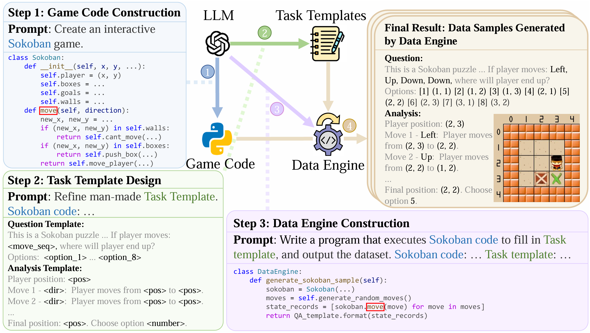

# Game-RL: Synthesizing Multimodal Verifiable Game Data to Boost VLMs’ General Reasoning

Code for the paper "[Game-RL: Synthesizing Multimodal Verifiable Game Data to Boost VLMs’ General Reasoning](https://arxiv.org/abs/2505.13886)".

This is the first work, to the best of our knowledge, that adapts ***game code*** to synthesize multimodal reasoning data for ***training*** VLMs. Furthermore, when when applied **Game-RL**, which is simple GRPO on **GameQA** (synthesized via our proposed **Code2Logic** approach), multiple cutting-edge open-source models exhibit significantly enhanced out-of-domain generalization.


[[📖 Paper](https://arxiv.org/abs/2505.13886)] [[🤗 GameQA-140K Dataset](https://huggingface.co/datasets/Gabriel166/GameQA-140K)] [[🤗 GameQA-5K Dataset](https://huggingface.co/datasets/Code2Logic/GameQA-5K)] [[🤗 GameQA-InternVL3-8B](https://huggingface.co/Code2Logic/GameQA-InternVL3-8B) ] [[🤗 GameQA-InternVL2.5-8B](https://huggingface.co/Code2Logic/GameQA-InternVL2.5-8B) ] [[🤗 GameQA-Qwen2.5-VL-7B](https://huggingface.co/Code2Logic/GameQA-Qwen2.5-VL-7B)] [[🤗 GameQA-LLaVA-OV-7B](https://huggingface.co/Code2Logic/GameQA-llava-onevision-qwen2-7b-ov-hf) ]

<div align=center></div>

## 👀 Introduction

Vision-language reinforcement learning (RL) has primarily focused on narrow domains (e.g. geometry or chart reasoning). This leaves broader training scenarios and resources underexplored, limiting the exploration and learning of Vision Language Models (VLMs) through RL. We find video games inherently provide rich visual elements and mechanics that are easy to verify. To fully use the multimodal and verifiable reward in video games, we propose Game-RL, constructing diverse game tasks for RL training to boost VLMs general reasoning ability. To obtain training data, we propose Code2Logic, a novel approach that adapts game code to synthesize game reasoning task data, thus obtaining the GameQA dataset of 30 games and 158 tasks with controllable difficulty gradation. Unexpectedly, RL training solely on GameQA enables multiple VLMs to achieve performance improvements across 7 diverse vision-language benchmarks, demonstrating the value of Game-RL for enhancing VLMs' general reasoning. Furthermore, this suggests that video games may serve as valuable scenarios and resources to boost general reasoning abilities.

### Code2Logic Approach

<div align=center></div>

For a selected game, the Code2Logic approach works as follows. We construct game code using LLMs at first. Then, design and refine some QA templates with the help of LLM. Finally, prompt the LLM to construct data engine based on the game code. During code execution, data engine fills out the QA templates to generate massive data samples containing correct and detailed reasoning processes.

### GameQA Dataset

<div align=center></div>

Our GameQA dataset transforms the game-playing tasks into Visual Question Answering format. It encompasses 30 different games classified into 4 categories based on the core capabilities required to solve game tasks, with 4 games from different categories and their example data samples illustrated in the image above. The data samples in GameQA are also reasonably graded (see [🤗 GameQA-140K](https://huggingface.co/datasets/Gabriel166/GameQA-140K)).

## 🚀 How to Use

The following steps will guide you on how to set up the environment, train, and evaluate the models.

1.  **Clone the Repository**
    ```bash
    git clone https://github.com/tongjingqi/Code2Logic.git
    cd Code2Logic
    ```

2.  **Download the Dataset**
    Download the [🤗 GameQA-5K](https://huggingface.co/datasets/Code2Logic/GameQA-5K) dataset. Please ensure the dataset is placed in an appropriate location within the project, e.g., `Code2Logic/data/GameQA-5K/`.

3.  **Setup Environment**
    
    ```bash
    # Install main dependencies 
    pip install vllm==0.7.3
    pip install flash-attn --no-build-isolation
    
    # Install ms-swift 
    cd ms-swift
    pip install -e .
    cd ..
    ```
    
4.  **Training and Evaluation**

    *   **Start the Reward Model**
        First, you need to start the reward model API. Execute the following in the `Code2Logic` root directory:
        
        ```bash
        bash scripts/reward_api.sh
        ```
        Ensure this service starts successfully and runs in the background.
        
    *   **Start Training**
        After the reward model is running, you can begin training the Qwen2.5-VL model. Execute the following in the `Code2Logic` root directory:
        ```bash
        bash scripts/train_qwen2_5vl.sh
        ```
    
    *   **Model Inference**
        Once training is complete, perform inference with your model to generate predictions. Execute the following in the `Code2Logic` root directory:
        ```bash
        bash scripts/infer.sh
        ```
        This will typically output a JSON file containing the model's predictions.
    
    *   **Evaluate Results**
        Use the `eval.sh` script to evaluate the JSON file output by `infer.sh`. Execute the following in the `Code2Logic` root directory:
        ```bash
        bash scripts/eval.sh path/to/your/inference_output.json
        ```
        *(Please replace `path/to/your/inference_output.json` with the actual path to your inference output file.)*
    
        **Note on Evaluation Model**: The evaluation in the paper follows the use of the `qwen2.5-72b-awq` model. You can also configure the script to use other evaluation APIs or models as needed.
        
        > *In our work, the inference and evaluation configurations were unified across both the original open-source models and our trained models.*

## 🎮 All Code for Generating GameQA samples

In this repository, we also provide the code used to generate samples for each game in GameQA - see the [src/](./src) directory. There are 30 directories in total - one for each game.

Apart form the code, each game directory contains:

1. A README file describing the game tasks and code execution instructions
2. A subdirectory with example samples

> 😎 Feel free to use the code directly to generate more samples, or adapt it to produce more types of training data for your specific requirements.
>

|                   |           3D Spatial Perception and Understanding            |               Pattern Recognition and Matching               |                     Multi-step Reasoning                     |                      Strategic Planning                      |
| :---------------- | :----------------------------------------------------------: | :----------------------------------------------------------: | :----------------------------------------------------------: | :----------------------------------------------------------: |
| **In Domain**     | [3D Maze](./src/3d_maze) <br> [Rubik's Cube](./src/rubiks_cube) <br> [3D Reconstruction](./src/3DReconstruction) | [Tangram](./src/tangram) <br> [Freecell](./src/freecell) <br> [Tetris](./src/tetris) <br> [Zuma](./src/zuma) <br/> [Spider Solitaire](./src/spider_solitaire) <br> [Color Hue](./src/hue) | [Langton's Ant](./src/langton_ant) <br> [2D Turing Machine](./src/2d_turing_machine) <br> [Word Search](./src/word_search) <br> [Tents](./src/tents) <br> [Rhythm Game](./src/rhythm_game) <br> [Star Battle](./src/star-battle) | [Sokoban](./src/sokoban) <br> [Maze](./src/maze) <br> [TicTacToe](./src/tictactoe) <br> [Ultra TicTacToe](./src/ultra_tictactoe) <br> [Space Invaders](./src/space_invaders) |
| **Out of Domain** | [Pyramid Chess](./src/PyramidChess) <br> [Minecraft](./src/minecraft) |    [Jewel2](./src/jewel2) <br> [Klondike](./src/klondike)    | [Sudoku](./src/sudoku) <br> [Lifegame](./src/lifegame) <br> [Minesweeper](./src/minesweeper) | [Snake](./src/snake) <br> [Chess Ranger](./src/chess_ranger) <br> [Pacman](./src/pacman) |


## 🤝 Acknowledgments

*We would like to acknowledge the valuable efforts of the following individuals, whose work on the data synthesis and validation processes was of great importance to the development of this project:* (Sorted by last name, then first name)

Ruifeng Chen, Yingqian Huang, Yutong Ke, Hengxi Lin, Yuanhao Ni, Qingyun Shi, Haitian Wang, Xiaoyong Wang, Yufei You, Juntao Zhang, Weixin Zhang, Yang Zhang

*We would like to acknowledge the valuable efforts of the following individuals from ByteDance, whose provide API for us to test models and give some technical instruction for us.*

Zhen Wang, Tao Liang, Zhihui Fei, Mingyang Wan, Guojun Ma
---

Our work also builds upon or makes use of the **ModelScope Swift (ms-swift)** framework, an excellent toolkit for efficient large model training and inference. We express our sincere gratitude to the developers of ms-swift for their support and contributions to the community.

*   **ms-swift Project:** [https://github.com/modelscope/ms-swift.git](https://github.com/modelscope/ms-swift.git)	

## 🔎 Citation

If you find our work (Game-RL) useful in your research, please consider citing our paper and ms-swift's:

```bibtex
@misc{tong2025code2logicgamecodedrivendatasynthesis,
      title={Game-RL: Synthesizing Multimodal Verifiable Game Data to Boost VLMs’ General Reasoning}, 
      author={Jingqi Tong and Jixin Tang and Hangcheng Li and Yurong Mou and Ming Zhang and Jun Zhao and Yanbo Wen and Fan Song and Jiahao Zhan and Yuyang Lu and Chaoran Tao and Zhiyuan Guo and Jizhou Yu and Tianhao Cheng and Changhao Jiang and Zhiheng Xi and Zhangyue Yin and Yining Zheng and Weifeng Ge and Guanhua Chen and Tao Gui and Xipeng Qiu and Qi Zhang and Xuanjing Huang},
      year={2025},
      eprint={2505.13886},
      archivePrefix={arXiv},
      primaryClass={cs.CL},
      url={https://arxiv.org/abs/2505.13886}, 
}

@misc{zhao2024swiftascalablelightweightinfrastructure,
      title={SWIFT:A Scalable lightWeight Infrastructure for Fine-Tuning},
      author={Yuze Zhao and Jintao Huang and Jinghan Hu and Xingjun Wang and Yunlin Mao and Daoze Zhang and Zeyinzi Jiang and Zhikai Wu and Baole Ai and Ang Wang and Wenmeng Zhou and Yingda Chen},
      year={2024},
      eprint={2408.05517},
      archivePrefix={arXiv},
      primaryClass={cs.CL},
      url={https://arxiv.org/abs/2408.05517},
}
```
