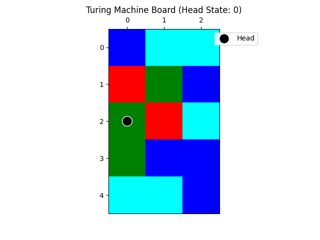

# 2D Turing Machine Q&A Generator

This project generates a dataset of 2D Turing machine boards, along with questions and answers about the state of the machine after a given number of steps. The dataset includes images of the boards, JSON files describing the board states, and a JSON file containing the questions and answers.

An example game image:



## Features

- Generates random 2D Turing machine boards with customizable sizes and states.
- Simulates the Turing machine for a specified number of steps.
- Generates multiple types of questions about the board's state after the simulation, including the following types:

- Position: Determines the final position of the Turing machine's head after a specified number of steps.
- Head State: Identifies the state of the Turing machine's head after a specified number of steps.
- Symbol at Position: Determines how the symbol at a specific position on the board changes during a specified number of steps.
- First State Entry: Identifies the step at which the Turing machine's head first enters a specific state.
 
- Saves board images, state descriptions, and Q&A data to specified directories.

## Requirements

- Python 3.x
- NumPy
- Matplotlib

## Installation

1. Install the required packages:
    ```sh
    pip install numpy matplotlib
    ```

## Usage

1. Open the `main.py` file and set the desired number of boards to generate:
    ```python
    num_boards = 8  # Example: You can modify this to generate more boards
    ```

2. Run the script to generate the dataset:
    ```sh
    python main.py
    ```

3. The generated dataset will be saved in the `2d_turing_machine_dataset` directory, which includes:
    - `images/`: Directory containing images of the boards.
    - `state/`: Directory containing JSON files describing the board states.
    - `data.json`: JSON file containing the questions and answers.

## Example

Here is an example of the generated Q&A entry in the `data.json` file:

```json
{
    "data_id": "turing-machine-train-00001",
    "plot_id": "turing-machine-train-plot-00001",
    "image": "images\\00001.jpg",
    "state": "state\\00001.json",
    "plot_level": "Medium",
    "qa_type": "State Prediction",
    "qa_level": "Medium",
    "question_id": 0,
    "question_description": "position",
    "question": "Question: where will the head be after 5 steps?\nOptions:\n1: (2, 3)\n2: (1, 4)\n...",
    "answer": 1,
    "options": ["(2, 3)", "(1, 4)", "..."],
    "analysis": "The head will visit these positions in order:...\nThe answer is option 1."
}
```

## Text-Only QA Conversion

To convert this game's multimodal QA data into a text-only version, run the unified converter from the repository root:

```bash
python src/Code_for_text_data_derivative/convert_text_data.py --game 2d_turing_machine --data src/2d_turing_machine/2d_turing_machine_dataset_example/data.json --output src/2d_turing_machine/2d_turing_machine_dataset_example/data_text.json
```

The converter reads each entry's `state` JSON, prepends a textual description of the visible game state to the original question, and writes `data_text.json` without the `image` or `state` fields by default.

Example text state fragment:

```text
2D TURING MACHINE STATE:
Grid symbols:
Row 0: [2, 4, 4]
Row 1: [0, 1, 2]
Row 2: [1, 0, 4]
Row 3: [1, 2, 2]
Row 4: [4, 4, 2]

Head: {'x': 0, 'y': 2, 'state': 0}

Transition rules:
if state=0 and symbol=0: write 1, change to state 1, move direction 1
if state=0 and symbol=1: write 4, change to state 1, move direction 1
if state=0 and symbol=2: write 0, change to state 0, move direction 0
if state=0 and symbol=3: write 1, change to state 0, move direction 1
if state=0 and symbol=4: write 4, change to state 0, move direction 2
...
```

## License

This project is licensed under the MIT License. See the [LICENSE](LICENSE) file for details.

## Acknowledgements

This project was inspired by the concept of Turing machines and their applications in theoretical computer science.
