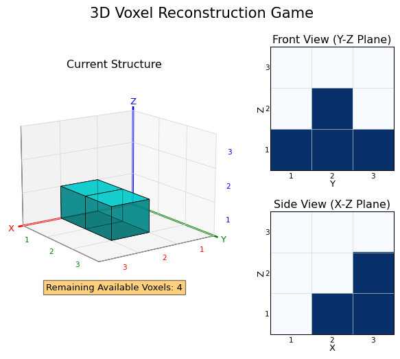

# 3D Reconstruction Game Q&A Dataset Generator

This directory provides two ways to generate Q&A data for the 3D reconstruction game:

1. `main.py`: standard mode, which usually generates one QA pair for one game state.
2. `multi_gen.py`: multi-question mode, which first generates game states and then generates all 6 question templates for each state.

An example game image:



## Installation

```bash
pip install -r requirements.txt
```

Dependencies include:

- Python 3.6+
- NumPy >= 1.19.0
- Matplotlib >= 3.3.0
- tqdm >= 4.65.0

## Game Rules

1. The game is played in a `3x3x3` voxel grid.
2. Coordinates `(x, y, z)` range from 1 to 3, where `(1,1,1)` is the front-left-bottom cell.
3. Each position can contain at most one voxel.
4. All voxels must stay face-connected.
5. New voxels can only be added adjacent to the current structure.
6. Projection rules:
   - Front view (`Y-Z`) is observed from the negative X direction.
   - Side view (`X-Z`) is observed from the positive Y direction.
   - A projection cell is `1` if any voxel exists along that line of sight; otherwise it is `0`.
7. The goal is to match the target projections within the remaining voxel budget.

## Difficulty Levels

The game uses two difficulty notions:

### Question Difficulty (`qa_level`)

- `Easy`
  - `count`: count voxels in the current structure
  - `position`: determine whether a position contains a voxel
- `Medium`
  - `projection`: judge how the current projections match the target projections
  - `action_outcome`: predict the projection after adding specified voxels
- `Hard`
  - `strategy_optimization`: find the minimum number of extra voxels needed
  - `transition_path`: choose the correct voxel-adding sequence

### Structure Difficulty (`plot_level`)

- `Easy`: 3-5 voxels
- `Medium`: 6-10 voxels
- `Hard`: 11-15 voxels

`--level-ratios` uses `x:y:z` format for `Easy:Medium:Hard`. At most one value can be omitted and will be filled automatically.

## Standard Mode: `main.py`

```bash
python main.py [arguments]
```

Available arguments:

- `--total N`: generate `N` questions, default `100`
- `--qa-types TYPE1 TYPE2 ...`: choose from `count`, `position`, `projection`, `action_outcome`, `strategy_optimization`, `transition_path`
- `--type-ratios RATIOS`: question-type ratios such as `0.2:0.2:0.2:0.2:0.1:0.1`
- `--level-ratios RATIOS`: structure-difficulty ratios such as `0.2:0.2:0.6`
- `--output PATH`: output directory, default `reconstruction_dataset`

Examples:

```bash
python main.py --total 100
python main.py --total 100 --qa-types count position projection
python main.py --total 100 --type-ratios 0.2:0.2:0.2:0.2:0.1:0.1 --level-ratios 0.2:0.2:0.6
```

## Multi-Question Mode: `multi_gen.py`

```bash
python multi_gen.py [arguments]
```

This mode first generates game states, then generates all 6 question templates for each state. That means:

- the QA-to-image/state ratio is roughly `6:1`
- total QA pairs = `total_states × 6`

Available arguments:

- `--total-states N`: generate `N` game states, default `100`
- `--level-ratios RATIOS`: structure-difficulty ratios such as `0.2:0.2:0.6`
- `--output PATH`: output directory, default `reconstruction_dataset`

Examples:

```bash
python multi_gen.py --total-states 50
python multi_gen.py --total-states 20 --level-ratios 0.2:0.2:0.6
```

## Output Format

Outputs are written to the directory specified by `--output`; if omitted, the default is `reconstruction_dataset/`:

### Standard Mode Output

```text
reconstruction_dataset/
├── data.json
├── images/
│   └── reconstruction_*.png
└── states/
    └── reconstruction_*.json
```

### Multi-Question Mode Output

```text
reconstruction_dataset/
├── data.json
├── images/
│   └── reconstruction_state_*.png
└── states/
    └── reconstruction_state_*.json
```

Each dataset entry contains:

- `data_id`
- `qa_type`
- `question_id`
- `question_description`
- `image`
- `state`
- `plot_level`
- `qa_level`
- `question`
- `answer`
- `analysis`
- `options` for multiple-choice questions only

## State File Format

```json
{
  "voxel_positions": [[1, 1, 1], [1, 2, 1], [2, 2, 1]],
  "target_yz_projection": [
    [1, 1, 0],
    [0, 1, 0],
    [1, 0, 0]
  ],
  "target_xz_projection": [
    [1, 1, 0],
    [1, 0, 0],
    [0, 0, 1]
  ],
  "remaining_voxels": 2
}
```

- `voxel_positions`: voxel coordinates in the current structure
- `target_yz_projection`: target front-view projection matrix
- `target_xz_projection`: target side-view projection matrix
- `remaining_voxels`: how many voxels can still be added

## Notes

1. `main.py` supports custom question-type ratios, while `multi_gen.py` always generates all 6 question types for each state.
2. Question-type ratios should sum to 1.
3. Difficulty ratios should sum to 1.
4. For a quick preview, see `reconstruction_dataset_example/`.
