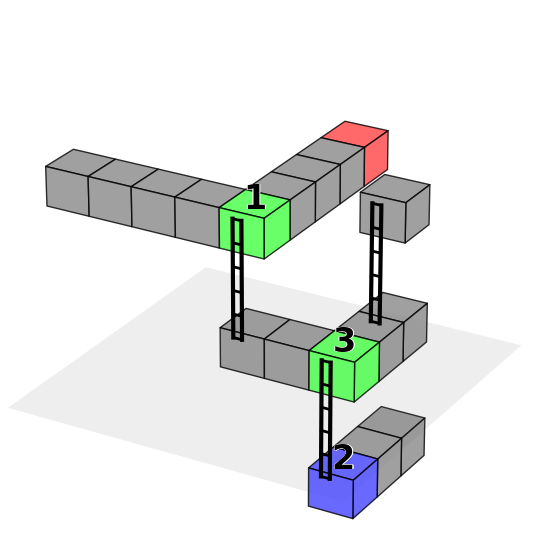

# 3D Maze Puzzle Generator

This project contains a 3D maze puzzle generator written in Python. The generator creates puzzles with various types of questions, including path-finding, sequence-finding, height comparison, and main path identification.

An example game image:



## Features

- **Path-Finding Puzzles**: Generate puzzles where the player must find the correct path from start to goal.
- **Sequence-Finding Puzzles**: Generate puzzles where the player must identify the correct sequence of checkpoints.
- **Height Comparison Puzzles**: Generate puzzles where the player must compare the heights of different points.
- **Main Path Identification Puzzles**: Generate puzzles where the player must identify which numbered blocks are on the main path.

## Usage

To generate a dataset of puzzles, run the following command:

```bash
python main.py
```

This will create a dataset with mixed problem types and save the images and states in the specified output directory.

You can easily change the number of questions generated by modifying last part in main.py:

```
if __name__ == "__main__":
    outputPath = os.path.join(BASE_DIR, "3d_maze_dataset_example")
    generate_mixed_dataset(15)
```

## Dependencies

- `numpy`
- `matplotlib`
- `mpl_toolkits.mplot3d`
- `dataclasses`
- `typing`
- `random`
- `json`
- `os`

Install the dependencies using pip:

```bash
pip install numpy matplotlib
```

## Directory Structure

- `outputFolder/images/`: Contains the generated puzzle images.
- `outputFolder/states/`: Contains the JSON state files for the puzzles.
  Each state file records the 3D maze layout, the ordered main path, ladders, and numbered markers used by the question.
  In the JSON, `branches` only stores real branch points with alternative paths, while `numbered_markers` stores all numbered blocks drawn in the image.
- `main.py`: Contains the puzzle generator classes and functions.

## Text-Only QA Conversion

To convert this game's multimodal QA data into a text-only version, run the unified converter from the repository root:

```bash
python src/Code_for_text_data_derivative/convert_text_data.py --game 3d_maze --data src/3d_maze/3d_maze_dataset_example/data.json --output src/3d_maze/3d_maze_dataset_example/data_text.json
```

The converter reads each entry's `state` JSON, prepends a textual description of the visible game state to the original question, and writes `data_text.json` without the `image` or `state` fields by default.

Example text state fragment:

```text
3D MAZE STATE:
Grid size: {'x': 8, 'y': 8, 'z': 7}
Start position: {'x': 7, 'y': 7, 'z': 0}
Goal position: {'x': 3, 'y': 5, 'z': 6}
Visible cubes. Path-solution labels are omitted; only non-solution visual markers are listed:
- position={'x': 5, 'y': 7, 'z': 0}, markers=[]
- position={'x': 6, 'y': 7, 'z': 0}, markers=[]
- position={'x': 7, 'y': 7, 'z': 0}, markers=['branch_point', 'numbered_block', 'start']
- position={'x': 7, 'y': 5, 'z': 3}, markers=[]
- position={'x': 7, 'y': 6, 'z': 3}, markers=[]
- position={'x': 5, 'y': 7, 'z': 3}, markers=[]
- position={'x': 6, 'y': 7, 'z': 3}, markers=[]
- position={'x': 7, 'y': 7, 'z': 3}, markers=['branch_point', 'numbered_block']
- position={'x': 7, 'y': 1, 'z': 6}, markers=[]
- position={'x': 7, 'y': 2, 'z': 6}, markers=[]
- position={'x': 7, 'y': 3, 'z': 6}, markers=[]
...
```

## License

This project is licensed under the MIT License.
