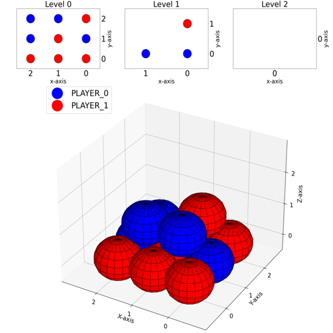

# Pyramid Chess
## Overview
The PyramidChess Dataset is a specialized dataset derived from the 3D strategy game PyramidChess, designed to support research in computer vision, natural language processing, and game-state understanding. Each data entry represents a specific game scenario, captured as a 3D game-state image, accompanied by structured question-answer pairs. There are six specific questions spanning three distinct types (e.g., Target Perception, State Prediction, and Strategy Optimization), each designed to probe strategic reasoning and spatial understanding.

In addition to the questions, the dataset provides detailed analyses and accurate answers, offering insights into the reasoning process behind each solution. By combining rich game-state imagery with comprehensive QA pairs and explanations, the PyramidChess Dataset serves as a tool for advancing AI research in spatial reasoning, strategy modeling, and explainable decision-making.

## Game Rule

```
Pyramid Chess Rules:
0.Game Board:
The game board is square and comes in various sizes: 3x3, 4x4, or 5x5. On an nxn board, there are n levels (0 to n-1). At each level k, the x and y coordinates range from 0 to n-1-k, resulting in (n-k)**2 slots per level. The slots in the lower levels act as the base for the slots in the upper levels. Slots at level 0 have no base, while slots at level j (j!=0) with coordinates (m,n) are supported by four base slots (m,n),(m+1,n),(m,n+1),(m+1,n+1) from level j-1.
1.Players and Initial Setup:
The game is played between two players, designated as PLAYER_0 and PLAYER_1, each using balls of a distinct color from their color pool. Players take turns placing their balls on a square game board. The number of balls available to each player depends on the size of the board: on a 3x3 board, each player has 7 balls; on a 4x4 board, each has 15 balls; and on a 5x5 board, PLAYER_0 (the first player to place a ball) has 28 balls, while PLAYER_1 has 27 balls.
2.Placing Balls and Creating New Slots:
At the start of the game, the lowest level of the board (Level 0) is completely open and balls can be placed in any available slot on this level. After a ball is placed in a slot, that slot is no longer available for placing another ball. A ball can only be placed on the upper level if it is supported by a fully completed 2x2 block of balls on the level directly beneath. All four slots in the 2x2 block must be filled for the upper ball to be placed.
3.Take-back mechnism:
If a player places a ball that completes a 2x2 block of the same color (all four balls belonging to that player), they may return up to two balls from the block to their color pool. A ball can only be removed if it does not have another ball directly above it, as removing a "base" ball would collapse the pyramid. Returning a ball reopens the slot it occupied, allowing it to be used for future placements, but the rule requiring a full 2x2 block as a base for placing balls on upper levels still applies. 
4.Winning the Game:
The game ends when one player successfully places the last ball on top of the pyramid. The player who place the ball on the top of the pyramid wins.
```

## Project Structure

The project is structured to efficiently generate the PyramidChess dataset through a modular workflow. The main entry point is main.py, which serves as the user interface, handling input and orchestrating the dataset generation process. It imports pyramidchess_data_generate, the core module responsible for creating dataset entries. This module relies on two additional components: pyramidchess_board_generate, which constructs valid game states adhering to PyramidChess rules, and pyramidchess_image_generate, which transforms these game states into 3D board images. Together, these modules produce comprehensive dataset entries that include 3D images, questions, analyses, and answers.

main.py (User Interface)
    |
    v
pyramidchess_data_generate (Dataset Generation)
    |
    +--> pyramidchess_image_generate (Image Generation)
    |                |
    |                v
    +--> pyramidchess_board_generate (Game State Creation)

## Output Contents/Dataset

### state

```json
{
    "0": [
        ["--","P0","--"],
        ["P0","--","P1"],
        ["--","P1","--"]
    ],
    "1": [
        ["--","--"],
        ["--","--"]
    ],
    "2": [
        ["--"]
    ]
}
```


### image



### [data.json](pyramidchess_dataset_example/data.json)

## Supported Question Types 

1. Choose a random coordinate and ask what status is the coordinate. （question_id:0）
    ```json
    {
        "qa_type": "TargetPerception",
        "qa_level": "Easy",
        "question": " What is the status of the ball on Level 0, which has coordinate ([0, 0])?\n
                        Options:\n1. PLAYER_0\n2. PLAYER_1\n3. Empty\n4. Index out of bound\n",
        "answer": 1,
        "analysis": "From the image provided, we can observe the layout of the pyramid across its levels. Based on level 0's grid (specifically at coordinate [0, 0]), the ball is blue, which corresponds to PLAYER_0.",
        "options": [
            "PLAYER_0",
            "PLAYER_1",
            "Empty",
            "Index out of bound"
        ]
    }
   ```

2. Select a coordinate and determine whether a ball can be placed at this coordinate. If so, what would happen after the place of the ball.（question_id:1）

   ```json
   {    
        "qa_type": "StatePrediction",
        "qa_level": "Medium",
        "question": "Can a ball be placed at coordinate [1, 0] on Level 0? If placed, what would be the outcome\n
        Options:\n1. Can place and no balls taken\n2. Can place and then balls can be taken\n3. Cannot place, position already occupied\n4. Cannot place, ball not ready below\n",
        "answer": 3,
        "analysis": "From the image provided, the coordinate [1, 0] on level 0 is already occupied, so it is not possible to place a ball there. Therefore, the status is: Cannot place, position already occupied.",
        "options": [
            "Can place and no balls taken",
            "Can place and then balls can be taken",
            "Cannot place, position already occupied",
            "Cannot place, ball not ready below"
        ]
   }
   ```

3. Calculate how many steps (turns) are required for a ball to be placed at certain coordinate.(Including the step putting the ball at the cooradinate)（question_id:2）

   ```json
   {
        "qa_type": "StatePrediction",
        "qa_level": "Hard",
        "question": "How many steps (turns) are required for a ball to be placed at coordinate [0, 0] on Level 2? (including the turn placing the ball)",
        "answer": "It needs 12 step(s).",
        "analysis": "To place a ball at coordinate [0, 0] on Level 2, we need to ensure all the balls in its sub-pyramid, which are the balls supporting the position, are placed.\nThis is determined by checking each level below the target position, from the highest level below it to the base level, and counting how many balls that support the position are missing in each layer. The total number of missing balls represents the steps needed.\nLevel 1: 4 more ball(s) need to be placed at [[0, 0], [1, 0], [0, 1], [1, 1]].\nLevel 0: 7 more ball(s) need to be placed at [[0, 0], [1, 0], [0, 1], [1, 1], [2, 0], [2, 1], [1, 2]].\nOnce all the required balls in the sub-pyramid are placed, the ball at the target position can be placed.\nTherefore, it needs 12 steps in total."
   }
   ```

4. Give out the best position to put the ball at a certain point of a game.（question_id:3）

   ```json
   {
        "qa_type": "StrategyOptimization",
        "qa_level": "Hard",
        "question": "It is PLAYER_0's turn Now.What is the best coordinate to put a ball in order to maximize the opportunity of winning.",
        "answer": "The best coordinate is (0, [4, 2])",
        "analysis": "To maximize the winning chance, one must try his best to form a 2x2 block of his color for the take-back mechanism. So that he avoid losing balls in his turn and therefore minimize the chance of running out of balls first.Blocking the opponents chance to form 2x2 block of his color also increase the oppotunity of winning.From the image provided,Putting a ball at [4, 2] at Level 0 stop the other player to form 2x2 block [[3, 1], [4, 1], [3, 2], [4, 2]].So the answer is Putting a ball at [4, 2] at Level 0."
   }
   ```

5. Calculate how many balls are there one the board.（question_id:4）

   ```json
   {    
        "qa_type": "TargetPerception",
        "qa_level": "Easy",
        "question": "How many balls are there on the board in the image. ",
        "answer": "There are 13 balls.",
        "analysis": "From the image provided. There are 9  balls in level 0. There are 4  balls in level 1. There are 0  balls in level 2. Therefore, There are 13 balls in total."
   }
   ```

6. Provide the higher level status of a coordinate: Is the coordinate legal? Does it contain a ball? Can the ball be taken? Can a ball be placed?（question_id:5）

   ```json
   {
        "qa_type": "TargetPerception",
        "qa_level": "Medium",
        "question": "What is the status of the ball on Level 0, which has coordinate ([0, 2])?\nIs the coordinate legal? Does it contain a ball? Can the ball be taken(has no ball directly above it)? Can a ball be placed?Options:\n1. The coordinate is out of bound\n2. It contain a ball and the ball can't be taken\n3. It contain a ball and can be taken\n4. It doesn't contain a ball and a ball can't be taken 5.It doesn't contain a ball and a ball can be taken\n",
        "answer": 2,
        "analysis": "From the image provided, there is a ball at the coordinate [0, 2] in level 0. And there are also balls sitting above the ball, so when the take-back happen, the ball can't be taken.Therefore, the status is it contain a ball and the ball can't be taken .",
        "options": [
            "The coordinate is out of bound",
            "It contain a ball and the ball can't be taken",
            "It contain a ball and can be taken",
            "It doesn't contain a ball and the player can put a ball here this turn",
            "It doesn't contain a ball and the player can't put a ball here this turn"
        ]
   }
   ```

## How to use
Install Dependencies:
Run the following command to install the required dependencies:
`pip install -r requirements.txt`

Run the Project:
Navigate to the PyramidChess directory and execute:
`python main.py -n 5000`

The -n argument specifies the number of data entries to generate. To change the number of entries, modify the value after -n.

Customize Data Generation:
Use -q and -l to selectively generate specific question types and difficulty levels. For example:
`python main.py -n 10 -q 0,1,5 -l Medium,Hard`

This command generates 10 entries with question types 0, 1, and 5, and difficulty levels "Medium" and "Hard".

Add -p Random to shuffle the dataset:
`python main.py -n 100 -p Random`

Set Starting ID:
Use -i to change the starting ID of the dataset. For instance:
`python main.py -n 500 -i 1000`
This will generate a dataset starting with ID 1000.

Example:
If you generate dataset with equal size of each qa_type, and the total size is 5000
run:
`python main.py -n 1250 -q 0,4,5`
`python main.py -n 3750 -i 1250 -q 1,2,3`

