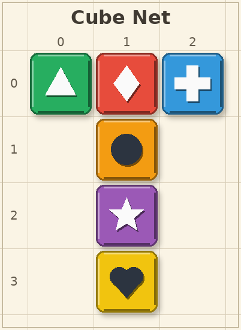

# Cube Net VQA Dataset Generator

A multimodal VQA dataset generator for **cube net folding** puzzles (3D spatial
perception and understanding). Each sample shows one of the 11 valid cube nets
drawn on graph paper: six square faces, each with a distinct color (red,
orange, yellow, green, blue, purple) and a distinct center symbol (star,
heart, triangle, circle, diamond, cross). Questions probe face identification,
opposite/adjacent face reasoning after folding, placed-cube orientation
reasoning, and cube vertex triples. The 11 nets are enumerated programmatically
(BFS over hexominoes + dihedral dedupe + an exact folding check), so the
puzzle generator is self-validating.



## Features

- Three visual difficulty levels (`plot_level`), classified by net shape family:
  - **Easy**: cross family (contains a straight strip of 4 faces), 110 px tiles
  - **Medium**: family whose longest straight strip is 3 faces, 95 px tiles
  - **Hard**: zigzag family (longest straight strip is 2 faces), 80 px tiles
    with a busier backdrop grid
- 5 task templates (`question_id` 1–5) spanning Target Perception and State
  Prediction, from Easy face identification to Hard orientation reasoning.
- Every entry ships a step-by-step `analysis` (fold orientation trace +
  conclusion) and exactly one correct option out of 5–8.
- Deterministic generation (`random.seed(20260717)`), PIL-only rendering,
  self-checking math (asserts on the 35 free hexominoes / 11 cube nets counts
  and on the classic cross-net fold).
- `verify.py` independently re-derives every answer from `states/*.json`
  (re-implementing the folding math from scratch) and re-checks all options.

## Game Rules

- The image shows a cube net: six square faces arranged edge-to-edge on graph
  paper; it can be folded along shared edges to form a cube.
- Each face has a distinct color and a distinct center symbol (white or dark
  ink, chosen by contrast).
- Row numbers are printed along the left of the grid, column numbers along the
  top; positions are written as `(row, column)`, both 0-based.
- After folding, every pair of faces is either **opposite** (never touching)
  or **adjacent** (sharing exactly one cube edge); exactly three faces meet at
  each cube vertex.

## Project Structure

```
src/cube_net/
├── README.md
├── requirements.txt
├── main.py                     # entry point: python main.py
├── cube_net.py                 # net enumeration, folding math, rendering, QA builders
├── verify.py                   # independent answer checker
└── cube_net_dataset_example/
    ├── data.json               # 69 QA entries
    ├── images/                 # board_00001.png ... board_00015.png
    └── states/                 # board_00001.json ... board_00015.json
```

Each state file stores the net id, the cell list, the grid size, and per-face
`cell / color / rgb / symbol / normal / up / right` (the 3D orientation frame
after folding), which is the complete ground truth for every question.

## Supported Question Types

- **Target Perception**
  - `question_id 1` (Easy): face identification — the color of the face with a
    given symbol, the symbol on a given color, or the grid position of a
    given color (sub-types rotate across boards).
- **State Prediction**
  - `question_id 2` (Medium): which face is opposite a given face after
    folding (6 options).
  - `question_id 3` (Medium): which set of four faces shares an edge with a
    given face after folding (exactly 5 near-miss options — every 4-subset
    of the other five colors; the correct set is the only one not containing
    the opposite face).
  - `question_id 4` (Hard): the cube is placed with face A on the BOTTOM and
    adjacent face B at the FRONT — which color is on a given SIDE face
    (RIGHT / LEFT / BACK)? The TOP face is never asked: it would always just
    be the opposite of the BOTTOM face, duplicating `question_id 2`.
  - `question_id 5` (Hard): which set of three faces meets at a single cube
    vertex?

## Usage

Prerequisites:

```
pip install -r requirements.txt
```

Generate the example dataset (15 images, 69 QA entries):

```
python main.py
```

Independently verify every answer:

```
python verify.py
```

`verify.py` prints a per-task summary and `ALL CHECKS PASSED` on success.

## License

MIT
