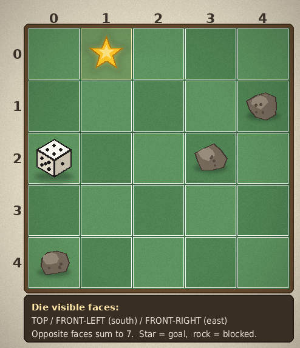

# Dice Roll VQA Dataset Generator

Generates a multimodal VQA dataset for a dice-rolling board puzzle. A standard
six-sided die (opposite faces sum to 7) sits on a grid board with rock
obstacles and a golden star goal cell. The die is rendered in isometric style
with three visible faces (TOP / FRONT-LEFT / FRONT-RIGHT), and questions probe
perception of the board, forward simulation of roll sequences, inverse
reasoning about which sequence produced a given result, and BFS-based optimal
planning with orientation constraints.



## Features

- Three visual difficulty levels (`plot_level`): Easy 5x5 (2-3 rocks),
  Medium 6x6 (3-5 rocks), Hard 7x7 (5-8 rocks). The die cell and the star
  cell are always connected (flood-fill check).
- 15 example images (5 per level) generated with a fixed seed (`20260718`)
  for full reproducibility, 60 QA entries (4 per image) covering all 4 task
  templates.
- Isometric die rendering with per-face shading and correct pip layouts;
  textured two-tone felt board, rock/star icons, drop shadows, vignette.
- Every entry ships with a step-by-step `analysis` and exactly one correct
  option out of 8.
- `verify.py` independently re-derives every answer from `states/*.json`
  (re-implemented roll mechanics + BFS, no generator code imported).

## Game Rules

- Positions are (row, column), 0-based; row numbers are printed on the left,
  column numbers on top.
- The die can be rolled North (up), South (down), East (right) or West (left);
  it tips onto the adjacent cell and the face opposite to the rolling
  direction comes to the top.
- If the target cell is a rock or off-board, the die does not move and its
  orientation is unchanged.
- Standard die: opposite faces sum to 7 (1-6, 2-5, 3-4), so the three hidden
  faces are fully determined by the three visible ones.

## Project Structure

```
src/dice_roll/
├── README.md
├── requirements.txt
├── main.py                 # entry point: python main.py
├── dice_roll.py            # game logic + PIL rendering + QA builders
├── verify.py               # independent answer checker
└── dice_roll_dataset_example/
    ├── data.json           # 60 QA entries
    ├── images/             # board_00001.png ... board_00015.png
    └── states/             # board_00001.json ... board_00015.json
```

## Supported Question Types

- **Target Perception** (`qa_level: Easy`, `question_id: 1`) — identify the
  number on the TOP / FRONT-LEFT / FRONT-RIGHT face, count the total visible
  pips, or locate the die / star cell.
- **State Prediction** (`qa_level: Medium`, `question_id: 2`) — given a
  sequence of 3-6 rolls (at most one blocked), predict the final TOP or
  FRONT-LEFT face value, or the final cell.
- **State Prediction** (`qa_level: Hard`, `question_id: 3`) — inverse task:
  given the final cell plus top and front-left face values, pick the one roll
  sequence (out of 8) that produces exactly that result.
- **Strategy Optimization** (`qa_level: Hard`, `question_id: 4`) — minimum
  number of rolls to move the die onto the star cell AND arrive with a
  required value on top (BFS over cell x orientation; ~30% of entries drop
  the top-face constraint).

## Usage

Prerequisites:

```
pip install -r requirements.txt
```

Basic usage:

```
python main.py     # regenerates dice_roll_dataset_example/ deterministically
python verify.py   # prints per-task summary and ALL CHECKS PASSED
```

## License

MIT
