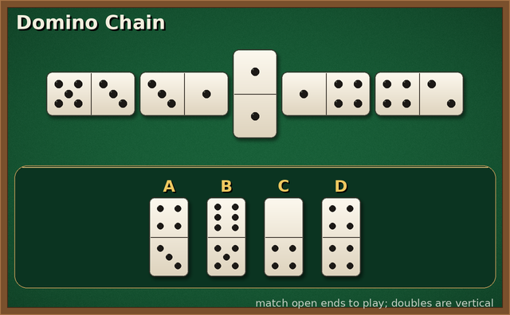

# Domino Chain VQA Dataset Generator

A Python tool for generating multimodal (image + question) QA data around a
classic domino chain layout. A chain of matching domino tiles is laid out on a
casino-felt table and a hand of labeled spare tiles (A, B, C, ...) sits on a
rack below it. For every rendered board the generator produces multiple-choice
questions about tile perception, move legality, state updates and optimal play,
each with a step-by-step analysis.

An example game image:



## Features

- **Random valid chain generation**: chains of 5-9 oriented tiles drawn from the
  28-tile double-six set (`chain[i][1] == chain[i+1][0]` always holds), doubles
  placed vertically.
- **Three difficulty sizes (plot_level)**:
  - Easy: chain of 5, hand of 4
  - Medium: chain of 6-7, hand of 5
  - Hard: chain of 8-9, hand of 6
- **Four task templates** (one of each per board, task 1 rotates sub-types):
  pip/value/double perception, playable-set prediction, open-end update after a
  move, and maximum chain extension (exact DFS over the hand).
- **Rich PIL rendering**: felt table with vignette and grain, wooden frame,
  ivory gradient tiles with drop shadows, standard 3x3 pip layouts, gold hand
  labels, supersampled for crispness.
- **Step-by-step analyses** ending in `So the answer is X. The option number is N.`
- **Independent verifier** (`verify.py`) that re-derives every answer from the
  saved states without importing the generator.

## Game Rules

- A domino tile has two halves; each half shows 0 (blank) to 6 pips. A tile with
  two equal halves is a **double**.
- The chain lies in one row, left to right. Adjacent tiles match: the right half
  of every tile equals the left half of the next tile.
- Doubles in the chain are placed **vertically**; all other chain tiles are
  horizontal.
- The chain has two **open ends**: the left half of the leftmost tile and the
  right half of the rightmost tile.
- A hand tile (labeled A, B, C, ..., drawn vertically and written `(upper|lower)`)
  can be played on an open end if either half matches that end's value. It is
  rotated so the matching half touches the chain, and its other half becomes the
  new value of that open end.

## Project Structure

```
.
├── domino.py        # Game logic, PIL rendering, QA builders
├── main.py          # Entry point: python main.py (seed 20260719)
├── verify.py        # Independent answer checker: python verify.py
├── requirements.txt
└── domino_dataset_example/
    ├── data.json    # 60 QA entries (MCQ)
    ├── images/      # board_00001.png ... board_00015.png
    └── states/      # board_00001.json ... board_00015.json (ground truth)
```

## Supported Question Types

- **Target Perception** (qa_level: Easy)
  1. Rotating sub-types: (a) count pips on one half of an end tile of the chain,
     (b) read the two values of a labeled hand tile, (c) count the doubles in
     the chain, (d) identify which hand tile is a double.
- **State Prediction** (qa_level: Medium)
  2. Determine which hand tiles can be legally played on either open end now.
  3. Predict the two open ends after a given hand tile is played on one end.
- **Strategy Optimization** (qa_level: Hard)
  4. Find the maximum number of hand tiles that can be played onto the chain in
     some order (exact search; an achieving sequence is given in the analysis).

## Usage

Prerequisites:

```bash
pip install -r requirements.txt
```

Basic usage:

```bash
python main.py     # regenerates domino_dataset_example/ deterministically
python verify.py   # re-checks every entry; prints ALL CHECKS PASSED
```

## License

MIT
