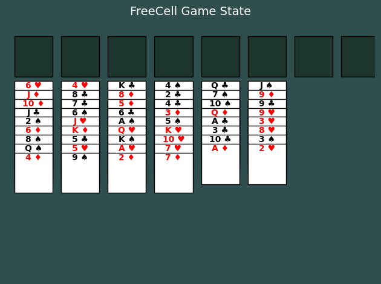

# FreeCell Puzzle Dataset Generator

This project generates FreeCell game state puzzles in JSON format. The dataset is used to create problem scenarios where players must analyze the game state and answer questions related to valid moves, future states, and game logic.

An example game image:



## 📌 Features
- **Generates FreeCell puzzles** with different problem types.
- **Creates datasets** in a structured JSON format.
- **Supports configurable dataset size** for flexibility.
- **Includes progress tracking** for long-running dataset generation.

---

## 🛠️ Installation
Ensure you have **Python 3.8+** installed. Clone the repository and install dependencies:

```sh
pip install python3.11.11
```

## 🚀 Usage

### Basic Usage
Run the script to generate datasets on a bash:
python main.py

This will:

Generate 1 puzzle (for every kind of puzzle with three types of plot level) in freecell_dataset_example/
Generate 600 puzzles (for every kind of puzzle with three types of plot level) in freecell_dataset/

### Custom Dataset Generation
if you want to change the number of puzzles generated,you can change the parameter "num_puzzles" in main.py

## 📂 Output Format
Each puzzle is stored in JSON format with the following structure:
{
    "data_id": "free_cell-card_after_move-1-00001",
    "plot_level": 1,
    "qa_type": "State Prediction",
    "question_id": 4,
    "question_description": "Given a particular game state...",
    "image": "path/to/image.png",
    "state": "path/to/state.json",
    "question": "Find the top card from cascade pile...",
    "answer": 3,
    "analysis": "Detailed explanation of the move...",
    "options": [
        "(Spades, 7)",
        "(Hearts, 9)",
        "(Clubs, 4)",
        "(Diamonds, 2)"
    ]
}

### Key Fields
data_id: Unique identifier for each puzzle.
question: The main FreeCell problem statement.
options: Multiple-choice answers.
answer: The correct answer index (1-based).
analysis: Explanation of the move and its effects.

## 🔧 Code Structure
freecell/
│── generator.py       # Core logic for dataset generation
│── main.py            # Script to run dataset generation
│── freecell.py        # FreeCell game logic and rules
│── requirements.txt   # Dependencies
│── README.md          # Documentation

## 📜 License
This project is licensed under the MIT License. Feel free to use and modify.

## Text-Only QA Conversion

To convert this game's multimodal QA data into a text-only version, run the unified converter from the repository root:

```bash
python src/Code_for_text_data_derivative/convert_text_data.py --game freecell --data src/freecell/freecell_dataset_example/data.json --output src/freecell/freecell_dataset_example/data_text.json
```

The converter reads each entry's `state` JSON, prepends a textual description of the visible game state to the original question, and writes `data_text.json` without the `image` or `state` fields by default.

Example text state fragment:

```text
FREECELL STATE:
Cascade piles:
Cascade 0: ['6 ♥', 'J ♦', '10 ♦', 'J ♣', '2 ♠', '6 ♦', '8 ♠', 'Q ♠', '4 ♦']
Cascade 1: ['4 ♥', '8 ♣', '7 ♣', '6 ♠', 'J ♥', 'K ♦', '5 ♣', '5 ♥', '9 ♠']
Cascade 2: ['K ♣', '8 ♦', '5 ♦', '6 ♣', 'A ♠', 'Q ♥', 'K ♠', 'A ♥', '2 ♦']
Cascade 3: ['4 ♠', '2 ♣', '4 ♣', '3 ♦', '5 ♠', 'K ♥', '10 ♥', '7 ♥', '7 ♦']
Cascade 4: ['Q ♣', '7 ♠', '10 ♠', 'Q ♦', 'A ♣', '3 ♣', '10 ♣', 'A ♦']
Cascade 5: ['J ♠', '9 ♦', '9 ♣', '9 ♥', '3 ♥', '8 ♥', '3 ♠', '2 ♥']
Free cells: [None, None, None, None]
Foundation piles: {'HEARTS': None, 'DIAMONDS': None, 'CLUBS': None, 'SPADES': None}
```
