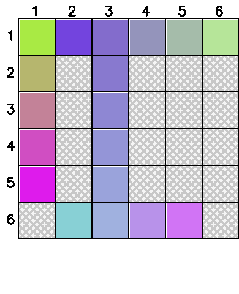

# Hue Q&A Generator

This project is a Q&A generator for color-based puzzles. It generates questions about color gradients and patterns on a grid, providing a variety of question types and difficulty levels.

An example game image:



## Features

- **Color Matching Questions**: Identify the correct color for a specific cell.
- **Color Description Questions**: Determine the color of a specific cell.
- **Gradient Pattern Questions**: Describe the gradient pattern in a row or column.

## Installation

To install the required dependencies, run:

```bash
pip install numpy pillow opencv-python
```

## Usage

To generate a dataset of questions, run the following script:

```python
python main.py
```

This will create a dataset of 10 questions and save the images and states in the `hue_dataset` folder.

## Example

Here is an example of how to generate a dataset:

```python
outputFolder = "hue_dataset"
dataset = generate_dataset(10)
print("Dataset generated successfully!")
print(f"Number of questions generated: {len(dataset)}")
```

## Output

The generated dataset includes:

- **Images**: Visual representation of the board with color options.
- **States**: JSON files containing the board state and gradient information.
- **Questions**: JSON files with the question text, options, and correct answers.

## Text-Only QA Conversion

To convert this game's multimodal QA data into a text-only version, run the unified converter from the repository root:

```bash
python src/Code_for_text_data_derivative/convert_text_data.py --game hue --data src/hue/hue_dataset_example/data.json --output src/hue/hue_dataset_example/data_text.json
```

The converter reads each entry's `state` JSON, prepends a textual description of the visible game state to the original question, and writes `data_text.json` without the `image` or `state` fields by default.

Example text state fragment:

```text
HUE PUZZLE STATE:
Rows and columns are read from top-left with 0-based indexes unless the question states otherwise.
Visible color board as RGB triples:
Row 0: [[169, 234, 68], [115, 68, 222], [131, 108, 204], [148, 148, 187], [165, 188, 170], [182, 229, 153]]
Row 1: [[182, 182, 110], [0, 0, 0], [136, 121, 207], [0, 0, 0], [0, 0, 0], [0, 0, 0]]
Row 2: [[195, 130, 152], [0, 0, 0], [142, 135, 211], [0, 0, 0], [0, 0, 0], [0, 0, 0]]
Row 3: [[208, 78, 194], [0, 0, 0], [148, 149, 215], [0, 0, 0], [0, 0, 0], [0, 0, 0]]
Row 4: [[222, 27, 236], [0, 0, 0], [154, 163, 219], [0, 0, 0], [0, 0, 0], [0, 0, 0]]
Row 5: [[0, 0, 0], [136, 208, 213], [160, 177, 223], [184, 146, 234], [209, 116, 245], [0, 0, 0]]
Removed/blank positions visible in the puzzle: []
Cell labels: {}
Gradient information visible from the board: [{'type': 'row', 'index': 5, 'direction': None, 'start_color': [136, 208, 213], 'en ...
Hidden removed color answers are intentionally omitted.
```

## License

This project is licensed under the MIT License.

