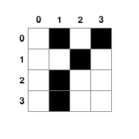

# Game of Life Dataset Generator

**Game of Life Dataset Generator** is a Python script designed to generate a dataset of multiple-choice questions based on Conway's Game of Life. The generated dataset includes various question types testing understanding of cellular automaton dynamics, from basic state counting to complex pattern predictions. Each question comes with detailed analysis and visual aids.

An example game image:



## Features

- **Multiple Question Types**: 
  - Target Perception: Basic questions about current grid state
  - State Prediction: Questions about next-step evolution
  - CellChangeCount: Questions about specific cell state changes
  - StabilitySteps: Questions about local region stability
- **Dynamic Grid Sizes**: Supports different grid sizes (3x3, 4x4, 5x5) for varying difficulty levels
- **Rich Analysis Generation**: Provides detailed step-by-step analysis for each question
- **Intelligent Target Selection**: Smart selection of regions and cells for questions
- **Configurable Generation**: Adjustable parameters for dataset size and complexity

## Game Rules

Conway's Game of Life follows these rules:
1. Any live cell with fewer than two live neighbors dies (underpopulation)
2. Any live cell with two or three live neighbors lives on to the next generation
3. Any live cell with more than three live neighbors dies (overpopulation)
4. Any dead cell with exactly three live neighbors becomes alive (reproduction)

## Project Structure

- `generate_dataset.py`: Main script containing:
  - Core Game of Life implementation
  - Question generation logic
  - Analysis generation
  - Multiple choice option generation
- Output directory structure:
  - `lifegame_dataset/images/`: PNG files of game board states
  - `lifegame_dataset/states/`: JSON files containing grid states
  - `lifegame_dataset/data.json`: Generated questions, answers, and analyses

## Question Types in Detail

### 1. Target Perception Questions
- Difficulty Level: Easy
- Tests basic state understanding
- Counts current live cells
- Example: "How many live cells are currently in the grid?"

### 2. State Prediction Questions
- Difficulty Level: Medium
- Tests evolution rule understanding
- Predicts next-step cell count
- Example: "After 1 iteration, how many live cells will remain?"

### 3. CellChangeCount Questions
- Difficulty Level: Medium
- Tracks specific cell changes
- Analyzes state evolution sequences
- Example: "How will the state of cell (2,3) change over 3 iterations?"

### 4. StabilitySteps Questions
- Difficulty Level: Hard
- Analyzes local region stability
- Considers both static and cyclic stability
- Example: "How many steps until this 3x3 region stabilizes?"

## Installation

### Prerequisites
```bash
pip install pygame numpy tqdm
```

### Usage
```bash
python generate_dataset.py
```

### Configuration
Key parameters in `generate_dataset.py`:
```python
# Grid sizes for different complexity levels
GRID_SETTINGS = {
    "Easy": 3,    # 3x3 grid
    "Medium": 4,  # 4x4 grid
    "Hard": 5     # 5x5 grid
}

# Default dataset size
num_samples = 1000
```

## Additional Notes

- Uses (row, col) coordinate system:
  - Row increases downward (0 at top)
  - Column increases rightward (0 at left)
- Generated questions are saved in JSON format with references to grid state files
- Includes timeout protection for generation processes
- Provides detailed generation statistics and error reporting

## Generated Files Structure

- Each question in `data.json` includes:
  - Question text and type
  - Multiple choice options
  - Correct answer
  - Detailed analysis
  - References to state and image files
- Image files show grid states with coordinate labels
- State files contain raw grid data in JSON format

## Text-Only QA Conversion

To convert this game's multimodal QA data into a text-only version, run the unified converter from the repository root:

```bash
python src/Code_for_text_data_derivative/convert_text_data.py --game lifegame --data src/lifegame/lifegame_dataset_example/data.json --output src/lifegame/lifegame_dataset_example/data_text.json
```

The converter reads each entry's `state` JSON, prepends a textual description of the visible game state to the original question, and writes `data_text.json` without the `image` or `state` fields by default.

Example text state fragment:

```text
LIFE GAME STATE:
Grid cells: 1=alive, 0=dead. Coordinates use row and column from the top-left.
Row 0: [0, 1, 0, 1]
Row 1: [0, 0, 1, 0]
Row 2: [0, 1, 0, 0]
Row 3: [0, 1, 0, 0]
Apply the standard Conway's Game of Life rules unless the question specifies otherwise.
```
