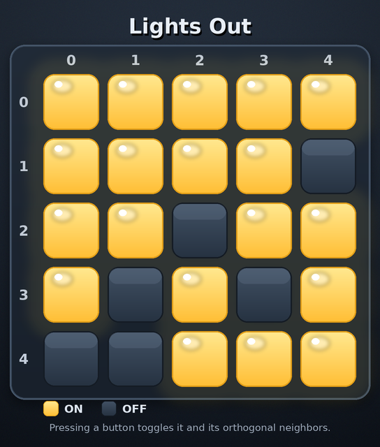

# Lights Out VQA Dataset Generator

This directory generates a deterministic multimodal question-answer dataset for
**Lights Out**. Each image shows a square grid of glowing yellow ON buttons and
dark slate OFF buttons, with explicit 0-based row and column labels. Pressing a
button toggles itself and its orthogonal neighbors; the classic goal is to turn
every light OFF.



## Features

- **15 distinct boards and 60 MCQ entries**: exactly four questions per image.
- Five boards at each visual level: **Easy = 3x3**, **Medium = 4x4**, and
  **Hard = 5x5**, yielding 20 entries per `plot_level`.
- Every board has question IDs 1, 2, and 4. Six special boards generated by
  exactly one or two presses also have question ID 3; each of the nine general
  boards has a second, different question-ID-1 or question-ID-2 variant.
- All ten builder variants are represented. The final counts are:
  `1a/1b/1c/1d = 5 each`, `2A = 10`, `2B = 9`, `3a/3b = 3 each`,
  `4numeric = 8`, and `4set = 7`.
- Every question includes the complete game rules and its options. `answer` is
  the **1-based option index**, and every `analysis` ends with
  `So the answer is X. The option number is N.`
- Generation is reproducible with the fixed seed **20260721**. Rendering uses a
  fixed background-noise seed, so PNG bytes are reproducible as well.

## Game Rules

For an `N x N` binary board, a press at `(row, column)` toggles up to five
cells: the pressed cell itself and its existing neighbors above, below, left,
and right. Toggle arithmetic is XOR: ON becomes OFF, and OFF becomes ON.
Pressing a button twice has no net effect, and press order does not affect the
final board.

The generator creates solvable, nonempty, non-all-ON boards by starting from an
all-OFF grid and applying distinct presses. Its exact solver represents the
puzzle as `A x = b` over GF(2), performs Gauss-Jordan elimination, enumerates
the affine null space, and selects a minimum-weight press solution.

## Supported Question Types

### Question ID 1 — Target Perception (Easy)

- **1a:** read the ON/OFF states of three specified cells in order.
- **1b:** count all ON lights.
- **1c:** identify the unique row with the most ON lights.
- **1d:** count ON lights in a specified column.

### Question ID 2 — State Prediction (Medium)

- **2A:** apply a sequence of distinct presses and predict the final ON count.
- **2B:** apply the sequence and predict three specified final cell states.

### Question ID 3 — Inverse State Prediction (Hard)

- **3a:** infer the single press that produced the shown board from all-OFF.
- **3b:** given one of exactly two generating presses, infer the other.

### Question ID 4 — Strategy Optimization (Hard)

- **4numeric:** determine the minimum number of presses that solves the board.
- **4set:** choose the only listed minimum-length press set that actually turns
  every light OFF; all seven distractor sets are independently simulated and
  guaranteed to fail.

## Project Structure

```text
src/lights_out/
├── README.md
├── requirements.txt
├── lights_out.py                 # rules, generator, solver, renderer, QA builders
├── main.py                       # deterministic dataset entry point
├── verify.py                     # independent parser, solver, and dataset checker
└── lights_out_dataset_example/
    ├── data.json                 # 60 GameQA records
    ├── images/                   # board_00001.png ... board_00015.png
    └── states/                   # board_00001.json ... board_00015.json
```

Each state file contains, in order:

- `size` and the binary `grid` shown in the image;
- `board_kind` (`single_press`, `two_press`, or `general`);
- the distinct `generation_presses` applied to the all-OFF board;
- `on_count`;
- solver metadata: `solvable`, `nullity`, `min_weight`, one optimal
  `min_presses` set, and `num_solutions`.

Each `data.json` record uses the shared GameQA field order:

```text
data_id, image, state, plot_level, qa_level, qa_type, question_id,
question_description, question, answer, analysis, options
```

## Usage

Install the two runtime dependencies:

```bash
python3 -m pip install -r requirements.txt
```

Regenerate the complete example dataset:

```bash
python main.py
```

Run the independent verifier:

```bash
python verify.py
# ALL CHECKS PASSED
```

`verify.py` does not import the generator's rules, solver, or QA builders. It
reconstructs every board from its saved generation presses, independently
solves it by enumerating all first-row press masks and chasing subsequent rows,
parses all 60 questions, re-derives every answer, validates every distractor,
checks schema and distributions, and confirms image dimensions and each cell's
rendered ON/OFF center pixel against the state grid.

## License

MIT
