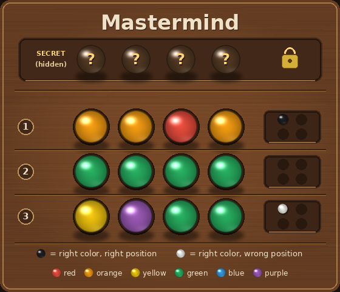

# Mastermind VQA Dataset Generator

Generates a multimodal VQA dataset for the classic code-breaking game **Mastermind**.
A hidden secret code of 4 colored pegs (6 available colors, repeats allowed) is covered
at the top of a wooden board; below it, numbered guess rows each show 4 glossy colored
pegs and a 2x2 feedback cluster (black peg = right color in the right position, white
peg = right color but wrong position). Every image is fully self-contained: all deduction
questions can be answered from the visible guesses and feedback alone.



## Features

- Three visual difficulty levels (`plot_level`): **Easy** = 3 guess rows, **Medium** = 4
  rows, **Hard** = 5 rows (always 4 pegs per code, 6 colors).
- 5 task templates (`question_id` 1-5): row perception, certainly in/out color
  deduction, consistency check, full secret deduction, and minimax next-guess strategy.
- Boards are generated by greedy adaptive guessing against the set of all 1296 possible
  codes: "multi" boards keep 10-150 consistent candidates (for perception/consistency/
  strategy tasks), "unique" boards pin the secret down to exactly 1 candidate (for the
  full-deduction task). Every shown feedback is recomputed and guaranteed correct.
- Every QA entry ships with a step-by-step `analysis` ending in
  `So the answer is X. The option number is N.`
- Deterministic generation with `random.seed(20260720)`.
- Independent `verify.py` re-derives every answer from `states/*.json` with its own
  re-implementation of the rules (brute force over all 1296 codes).

## Game Rules

- The secret code consists of 4 pegs in a row (positions 1-4, left to right), each one
  of 6 colors: red, orange, yellow, green, blue, purple. Repeats are allowed.
- After each guess the code-maker gives feedback: one **black** peg per peg that is the
  correct color in the correct position, one **white** peg per peg that is a correct
  color but in the wrong position. Feedback peg positions carry no positional meaning;
  black + white never exceeds 4.
- The secret row is covered (four dark caps marked `?`); the goal is to deduce it from
  the guesses and their feedback.

## Project Structure

```
src/mastermind/
├── README.md
├── requirements.txt
├── main.py                      # entry point: python main.py
├── mastermind.py                # game logic + PIL rendering + QA builders
├── verify.py                    # independent answer checker
└── mastermind_dataset_example/  # committed example dataset
    ├── data.json                # 60 QA entries
    ├── images/                  # board_00001.png ... board_00015.png
    └── states/                  # board_00001.json ... board_00015.json
```

Each state file stores the full ground truth: `code_length`, `num_colors`, the color
list, the `secret`, every guess row (`row`, `pegs`, `black`, `white`), the board type
(`multi`/`unique`) and the size of the still-consistent candidate set.

## Supported Question Types

**Target Perception** (qa_level: Easy)
1. Read a guess row: (a) the four peg colors left to right, (b) how many black/white
   feedback pegs it received, or (c) how many pegs of a given color it contains.

**State Prediction** (qa_level: Medium / Hard)
2. Which colors are CERTAINLY in the secret code, or CERTAINLY NOT in it (derived from
   the set of codes consistent with all feedback). (Medium)
3. Which one of 8 candidate codes is consistent with every row of feedback
   (distractors fail exactly one row, usually by exactly one peg). (Medium)
4. Deduce the exact secret code; the board is generated so that exactly one of the
   1296 codes is consistent with all rows. (Hard)

**Strategy Optimization** (qa_level: Hard)
5. Among 4 candidate guesses (drawn from the still-consistent set), pick the one that
   minimizes the worst-case number of remaining possible codes after its feedback is
   known (strict unique minimax argmin guaranteed).

## Usage

Prerequisites:

```bash
pip install -r requirements.txt
```

Basic usage (regenerates `mastermind_dataset_example/` deterministically):

```bash
python main.py
```

Verify the dataset (recomputes every answer independently):

```bash
python verify.py
# -> ALL CHECKS PASSED
```

## License

MIT
