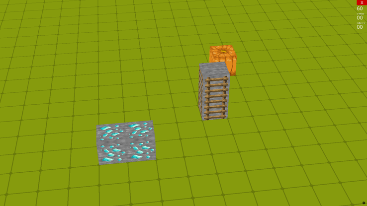
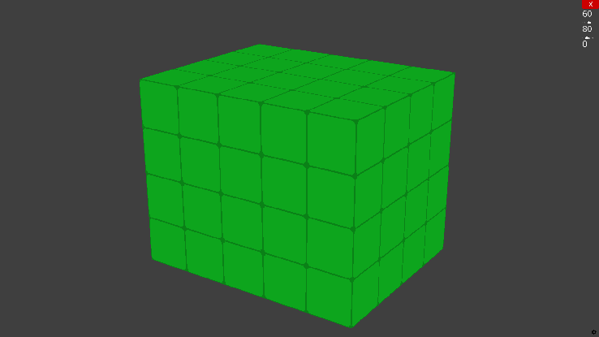
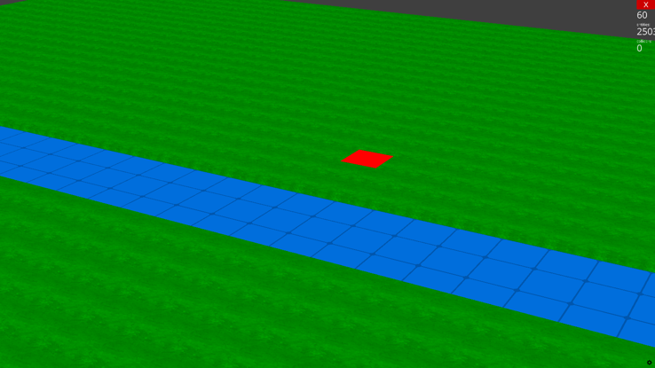
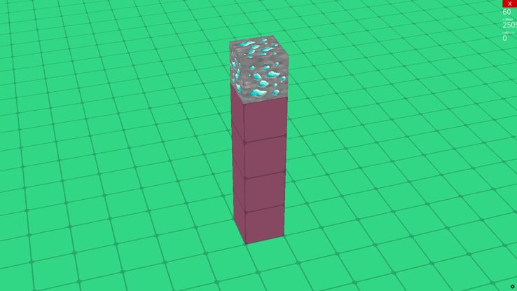
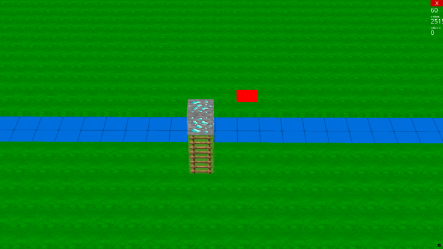

# Minecraft QA Generator

This module generates QA data in a simplified Minecraft-like 3D world. The tasks are designed to test visual recognition, counting, river crossing, and block-climbing reasoning in scenes rendered with Ursina.

## Dependencies

```bash
pip install -r requirements.txt
```

## Usage

```bash
python main.py --out-dir minecraft_dataset --num-per-question 5
```

- `--num-per-question N`: generate `N` samples for each question family
- `--out-dir DIR`: output directory

The script generates 5 question families, so the total number of QA entries is `5 × N`.

## Game Conventions

- All objects are built from unit cubes.
- The red square marks the player position when movement planning is involved.
- Rivers are rendered as blue grid strips so their width can be counted.
- Target blocks in climbing tasks are chosen from `pumpkin`, `gold ore`, and `diamond ore`.
- Ladders may already exist on stacked blocks and can reduce the required number of placed blocks.

## Question Types and Example Images

### 1. Scenery Recognition

Recognize which sceneries appear in the scene. Candidate sceneries include bricks, ores, TNT, pumpkin, ladder, river, and lava.



- `question_id`: 1
- `qa_type`: `Target Perception`
- `qa_level`: `Easy`
- `plot_level`: determined by the number of scenery types in the scene (`3/4/5 -> Easy/Medium/Hard`)

### 2. Cube Counting

Count the total number of cubes in a cuboid structure.



- `question_id`: 2
- `qa_type`: `Target Perception`
- `qa_level`: `Medium`
- `plot_level`: determined by total cube count (`<=30 / <=70 / >70`)

### 3. Cross-River Planning

Find the minimum number of blocks needed to cross a river by building straight across it.

In this question family, the red square explicitly marks the player's current position.



- `question_id`: 3
- `qa_type`: `State Prediction`
- `qa_level`: `Medium`
- `plot_level`: determined by river width

### 4. Climb-to-Target Planning

Find the minimum number of blocks needed to reach a target block, considering target height and whether ladders already exist.



- `question_id`: 4
- `qa_type`: `State Prediction`
- `qa_level`: `Medium`
- `plot_level`: determined by the number of blocks under the target

### 5. Cross-River + Climb Planning

Find the minimum number of blocks needed to reach a target block when the player may first need to cross a river and then climb.

In this question family, the red square explicitly marks the player's current position.



- `question_id`: 5
- `qa_type`: `State Prediction`
- `qa_level`: `Hard`
- `plot_level`: determined jointly by river width and target height

## Output

The generator writes:

- `data.json`: QA records
- `images/*.png`: rendered scenes
- `states/*.json`: compact state metadata used to compute answers

Example output directory:

```text
minecraft_dataset/
├── data.json
├── images/
└── states/
```

## Notes

- The generator uses `Ursina` screenshots, then resizes them with `utils/image_proc.py`.
- `main.py` always generates the five question families in order: scenery recognition, cube count, cross river, climb, and cross river + climb.
