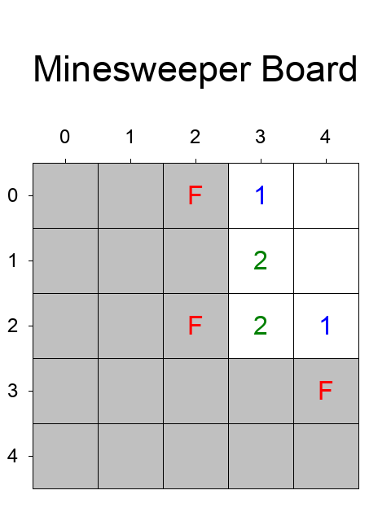

# Minesweeper VQA Dataset Generator

## Overview
**Minesweeper VQA Dataset Generator** is a tool designed to simulate the classic game **Minesweeper** and generate a comprehensive Visual Question Answering (VQA) dataset. It creates game images with various configurations and size of the game board. Based on these images, it generates different types of questions about the game state and actions. The generated VQA dataset includes game images, questions, answers, and detailed analyses, making it suitable for training multimodal models.

An example game image:



## Game Rules

### Elements
#### Board Configuration
- **Empty Cells (Revealed)**: Cells that have been revealed and contain either a number (indicating the number of adjacent mines) or are empty (no adjacent mines).
- **Mines (Hidden)**: Hidden mines that must be flagged by the player.
- **Flagged Cells**: Cells flagged by the player as potential mine locations.

#### Operations
1. **Reveal**:
   - Reveals the cell at a given coordinate.
   - If the cell contains a mine, the game ends.
   - If the cell is empty, adjacent cells may also be revealed recursively.

2. **Flag**:
   - Marks a cell as a potential mine location. Does not affect adjacent cells.

3. **Game Objective**:
   - Reveal all cells that do not contain mines, while correctly flagging all mine locations.

### Coordinate System
- **0-based coordinates**.
- **Top-left cell**: (0, 0)
- **Bottom-right cell**: Varies based on the chessboard size (e.g., for a 5x5 board, (4, 4)).

## Output Contents

### 1. Image Files
- **Location**: `minesweeper_dataset_example/images/`
- **Content**: Generated images representing the current game state, including revealed cells, flagged mines, and hidden mines.
- **Naming Convention**: Sequentially named as `board_00001.png`, `board_00002.png`, etc.

### 2. State Files
- **Location**: `minesweeper_dataset_example/states/`
- **Content**: JSON files saving the current game state, including board configuration, revealed cells, flagged cells, and mine locations.
- **Naming Convention**: Sequentially named as `board_00001.json`, `board_00002.json`, etc.

### 3. VQA Dataset
- **File**: `minesweeper_dataset_example/data.json`
- **Content**: JSON array with entries containing:
  - `data_id`
  - `qa_type`
  - `question_id`
  - `question_description`
  - `image`
  - `state`
  - `plot_level`
  - `qa_level`
  - `question`
  - `answer`
  - `analysis`
  - `options` (only for multiple-choice questions)

## Dataset Details

### Difficulty Levels
The Minesweeper VQA dataset supports three levels of difficulty, each with different board sizes and mine counts:
- **Easy**: 4x4 board with 3 mines.
- **Medium**: 5x5 board with 5 mines.
- **Hard**: 6x6 board with 8 mines.

### Supported Question Types
#### Questions About the Current Game State
1. **Mine Counting**
   - *Example*: **How many mines are currently flagged?**
   - **Type**: Fill in the blank

2. **Revealed Cell Counting**
   - *Example*: **How many cells have been revealed?**
   - **Type**: Fill in the blank

3. **Cell Status**
   - *Example*: **What is the state of the cell at (2, 3)?**
   - **Type**: Multiple choice
   - **Options**:
     - A. It is revealed and shows a number.
     - B. It is flagged as a mine.
     - C. It is still hidden.
     - D. It is revealed and shows no more information.

#### Questions About Actions
1. **Reveal Operation Outcome**
   - *Example*: **What will happen if you reveal the cell at (1, 2)?**
   - **Type**: Multiple choice
   - **Options**:
     - A. The game will end because the cell contains a mine.
     - B. The cell will reveal an empty area, and adjacent cells will also be revealed.
     - C. The cell will reveal the number {value1}.
     - D. Undecidable. It may contain a mine or not.

2. **Best Next Move**
   - *Example*: **What is the best next move at (3, 4)?**
   - **Type**: Multiple choice
   - **Options**:
     - A. Flag this cell as a mine.
     - B. Reveal this cell.
     - C. Skip this move and wait for more information.
     - D. Analyze adjacent cells.

#### Strategy Questions
- *Example*: **What command will result in the maximum number of cells being revealed in a single move?**
- **Type**: Fill in the blank

## How to Use

### 1. Install Dependencies
Before generating the VQA dataset, ensure that all required Python packages are installed. It's recommended to use a virtual environment to manage dependencies.

1. **Set Up a Virtual Environment** *(Optional but recommended)*:
   ```bash
   python -m venv venv
   ```
   - **Activate the Virtual Environment**:
     - **Windows**:
       ```bash
       venv\Scripts\activate
       ```
     - **macOS/Linux**:
       ```bash
       source venv/bin/activate
       ```

2. **Install Required Packages**:
   ```bash
   pip install -r requirements.txt
   ```

### 2. Generate the VQA Dataset
```bash
python main.py
```
- **Actions**:
  - Generates game states and corresponding images in the `minesweeper_dataset_example/images/` directory.
  - Saves game states as JSON files in the `minesweeper_dataset_example/states/` directory.
  - Creates VQA entries and compiles them into `minesweeper_dataset_example/data.json`.

### 3. Customize Generation Parameters
You can adjust the dataset generation parameters by modifying the `main.py` script:

- **Number of Samples per Difficulty Level**:
  - Locate the following line in `main.py`:
    ```python
    num_samples_per_level = 10  # Adjust as needed
    ```

- **Difficulty Levels and Board Sizes**:
  - The script supports three difficulty levels, each with a corresponding board size:
    ```python
    plot_levels = [
        {"plot_level": "Easy", "rows": 4, "cols": 4, "mines": 3},
        {"plot_level": "Medium", "rows": 5, "cols": 5, "mines": 5},
        {"plot_level": "Hard", "rows": 6, "cols": 6, "mines": 8}
    ]
    ```

## Text-Only QA Conversion

To convert this game's multimodal QA data into a text-only version, run the unified converter from the repository root:

```bash
python src/Code_for_text_data_derivative/convert_text_data.py --game minesweeper --data src/minesweeper/minesweeper_dataset_example/data.json --output src/minesweeper/minesweeper_dataset_example/data_text.json
```

The converter reads each entry's `state` JSON, prepends a textual description of the visible game state to the original question, and writes `data_text.json` without the `image` or `state` fields by default.

Example text state fragment:

```text
MINESWEEPER VISIBLE STATE:
Grid size: 5 rows x 5 columns.
Cells: digit=visible clue, F=flagged, .=unrevealed. Hidden mines are not shown.
Row 0: ['.', '.', 'F', '1', '0']
Row 1: ['.', '.', '.', '2', '0']
Row 2: ['.', '.', 'F', '2', '1']
Row 3: ['.', '.', '.', '.', 'F']
Row 4: ['.', '.', '.', '.', '.']
```

## License
This project is licensed under the [MIT License](LICENSE).
