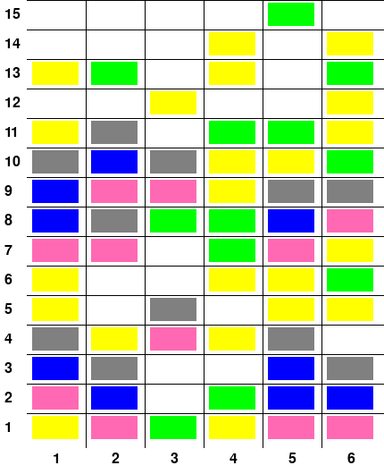

# Rhythm Game

## Code Usage

You can adjust the number of images needed for each difficulty level in the main function.

Code save path: `data.json`

You need to install the `pygame` module.


## Game Type

1. Global information is fully observable

2. The scene changes dynamically
   1. A falling-note rhythm game, where blocks fall over time
   2. Difference from traditional rhythm games: interaction between the player and the scene is added


### Game Description

Now I give you an image showing a screenshot of a rhythm game, with operation blocks of various colors. In this game, the operation blocks fall at a speed of 1 cell/s. At the same time, you may choose one column to place your finger on (and you cannot move your finger after choosing it), and click the operation blocks in that column when they fall to row 1 in order to score points. Of course, you may also choose not to click any column, which does not affect the falling of the operation blocks.\nWe divide the operation blocks into 3 categories: click blocks, reverse blocks, and snake blocks, as follows:\n1. Click blocks are yellow, occupy 1 cell, and give 10 points when clicked.\n2. Reverse blocks are green, occupy 1 cell, and give 15 points when clicked. Note that after you click a reverse block, the entire scene is **reversed left and right**, but your finger position **does not** change.\n3. A snake block occupies 2 or more consecutive cells in one column. Its first cell (called the snake head block) is pink, its last cell (called the snake tail block) is gray, and the middle cells (called snake body blocks, if any) are blue. Only when you click **all cells** occupied by the snake block can you score points. The score depends on the length $l$ of the snake block (including head and tail), and is specifically $l \cdot (2l + 7)$.\nNow I will give you a question about this game. Please extract information from the image, think carefully, reason, and answer:\n


## Changes

Difference from traditional rhythm games: **<u>decision points need to be added</u>**

1. Adjust the interaction between the player and the game:
   1. The player's click -> **<u>choose one column to click</u>**
   2. **<u>Clicking a reverse block flips the entire scene left and right</u>**, which can increase the difficulty in some questions
      1. ps: after clicking a reverse block, the selected column does not flip, but the grid does flip


## Block Settings

|        |                    Description                    |              Color               |       Score        |
| :----: | :-----------------------------------------------: | :------------------------------: | :----------------: |
| Click Block |                   Occupies 1 cell                   |             Yellow              |         10         |
| Reverse Block | Occupies 1 cell, clicking it flips the whole scene left and right |             Green               |         15         |
|  Snake Block  | Occupies 2 to 5 consecutive cells in one column | Head pink, tail gray, body blue | $l \cdot (2l + 7)$ |


## Question Templates

1. Ask what type of block a certain cell belongs to in the current image

   ```json
   {
       "qa_level": "Easy",
       "qa_type": "Target Perception",
       "question_id": 1,
       "question_description": "Find the type of the block in a given coordinate.",
       "question": game_explanation + " Which type of block does row {row} and column {col} in the image belong to? Options: {option_list}",
       "answer": "{option_number}",
       "analysis": "The cell at row {row} and column {col} in the image is {block_color}, which means it is a {block_type} block. So, the answer is {option_number}",
       "options": ["Non-type", "Click", "Reverse", "Snake Head", "Snake Body", "Snake Tail"]
   }
   ```

2. Ask what proportion of the current image is occupied by operation blocks, retaining 3 significant figures (fill-in-the-blank)

   ```json
   {
       "qa_level": "Easy",
       "qa_type": "Target Perception",
       "question_id": 2,
       "question_description": "Find the percentage of cells with blocks, retaining 3 significant figures.",
       "question": game_explanation + " What percentage of the grid in the current image is occupied by the operation blocks? The answer is expressed as a decimal, retaining 3 significant figures.",
       "answer": "{current_answer}",
       "analysis": "There are {row_num} rows and {col_num} columns in the grid, which means there are {row_num} * {col_num} = {cell_num} cells in total. {counting_row_cells}\nIn total, there are {adding_blocks} = {blocked_cell_num} cells occupied by blocks in the image. So, the answer is {blocked_cell_num} / {cell_num} = {current_answer}"
   }
   ```

3. Without selecting any column to click, after $k$ seconds, what is the length of the snake block headed by $(x_0, y_0)$ (that is, its lower end)? The snake length is 2 to 5.

   ```json
   {
       "qa_level": "Medium",
       "qa_type": "State Prediction",
       "question_id": 3,
       "question_description": "Find the length of the snake block headed by a given coordinate after a given number of seconds.",
       "question": game_explanation + " Without selecting any column to click, what is the length of the snake block headed (which means being the lower end) by {head_position_after} after {time} second(s)? Options: {option_list}",
       "answer": "{option_number}",
       "analysis": "Because the blocks fall at the speed of 1 cell/second, before {time} second(s), the head cell of that Snake block should be at {head_position_before}. From the image we can see that the Snake block starts from {head_position_before} occupies {length} cells. So, the answer is {option_number}",
       "options": ["2", "3", "4", "5"]
   }
   ```

4. Ask for the final score when choosing a certain column to click

   ```json
   {
       "qa_level": "Medium",
       "qa_type": "State Prediction",
       "question_id": 4,
       "question_description": "Find the final point of choosing a given column to click.",
       "question": game_explanation + " While selecting column {select_col} to click, how many points will you get? Options: {option_list}",
       "answer": "{option_number}",
       "analysis": "We count from bottom to top.\n{counting_procedure}So, the final point is {adding_points} = {final_point}, the answer is {option_number}",
       "options": []
   }
   ```

5. When reversing the grid takes 1 second, ask for the final score when choosing a certain column to click

   ```json
   {
       "qa_level": "Medium",
       "qa_type": "State Prediction",
       "question_id": 5,
       "question_description": "Find the final point of choosing a given column to click when it takes 1 second to reverse the grid.",
       "question": game_explanation + " Now it takes 1 second to reverse the grid, during which the blocks will still be falling, but you can't click them. While selecting column {select_col} to click, how many points will you get? Options: {option_list}",
       "answer": "{option_number}",
       "analysis": "We count from bottom to top.\n{counting_procedure}So, the final point is {adding_points} = {final_point}, the answer is {option_number}",
       "options": []
   }
   ```

6. Ask which column gives the highest final score

   ```json
   {
       "qa_level": "Hard",
       "qa_type": "Strategy Optimization",
       "question_id": 6,
       "question_description": "Find choosing which column to click can get the highest score.",
       "question": game_explanation + " Which column(s) should I choose to click to get the highest final score? Options: {option_list}",
       "answer": "{option_numbers}",
       "analysis": "{counting_procedure}We can see that when choosing column(s) {max_col}, the final point is the highest, being {max_point}. So, the answer is {option_numbers}",
       "options": []
   }
   ```

7. When reversing the grid takes 1 second, ask which column gives the highest final score

   ```json
   {
       "qa_level": "Hard",
       "qa_type": "Strategy Optimization",
       "question_id": 7,
       "question_description": "Find choosing which column to click can get the highest score when it takes 1 second to reverse the grid.",
       "question": game_explanation + " Now it takes 1 second to reverse the grid, during which the blocks will still be falling, but you can't click them. Which column(s) should I choose to click to get the highest final score? Options: {option_list}",
       "answer": "{option_numbers}",
       "analysis": "{counting_procedure}We can see that when choosing column(s) {max_col}, the point is the highest, being {max_point}. So, the answer is {option_numbers}",
       "options": []
   }
   ```

ps: Questions 6 and 7 may have multiple correct answers.


## Code Explanation

1. The current setting is that the total number of blocks of the three types (not the number of occupied cells) is 1/2 of the total number of cells in the board, so the final number of occupied cells is slightly more than 1/2 of the total.
2. The ratio of the three kinds of blocks can be customized (currently click:reverse:snake = 7:4:3), but the proportion of snake blocks should not be too high, otherwise too many cells will be occupied.
3. ```json
   {
       "Easy": {
           "row_num": 15,
   		"col_num": 4
       },
       "Medium": {
           "row_num": 15,
   		"col_num": 6
       },
       "Hard": {
           "row_num": 20,
   		"col_num": 6
       }
   }
   ```

   


## Data Display

### Game Description

```
Now I'll give you a picture, which shows a screenshot of a rhythm game, in which there are operation blocks of various colors. In this game, the operation blocks will fall at a speed of 1 cell/second. At the same time, you can select a column to place your finger (you cannot move your finger after selecting it), and click the operation blocks in the column that fall to the first row to score points (of course, you can also choose not to click any column, which will not affect the falling of the operation blocks). \nFor the operation blocks, we divide them into 3 categories, including Click blocks, Reverse blocks, and Snake blocks, as follows: \n1. Click blocks are yellow, occupy 1 cell, and you can get 10 points by clicking them. \n2. Reverse blocks are green, occupy 1 cell, and you can get 15 points by clicking them. It should be noted that after you click the Reverse block, the entire game situation will **reverse left and right**, but your finger position **will not** change accordingly. \n3. A Snake block occupies 2 or more consecutive cells in a column, and its first cell (called Snake Head block) is pink, its last cell (called Snake Tail block) is grey, and the middle cells (called Snake Body blocks, if any) are blue. Only when you click on **all cells** occupied by the snake block can you score points. The score is related to the length $l$ (including the head and tail) of the snake block. The specific score is $l \cdot (2l + 7)$. \nNow I will give you a question about the game. Please extract information from the picture I give you, think carefully, reason and answer: \n
```


### state

```json
{
    "rows": 15,
    "cols": 4,
    "blocked_cell_num": 48,
    "block_info": [
        {
            "row": 4,
            "col": 2,
            "color": "pink"
        },
        ...
    ]
}
```


### image

An example game image:


