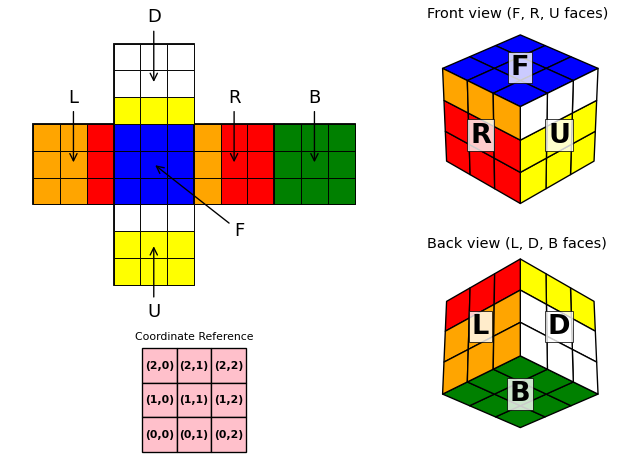

# Rubik's Cube VQA Dataset Generator

**Rubik's Cube VQA Dataset Generator** is a tool that creates a comprehensive Visual Question Answering (VQA) dataset based on the Rubik's Cube puzzle. It generates both 3D and unfolded views of Rubik's cube states and creates diverse question types to test spatial reasoning, pattern recognition, and problem-solving skills. The dataset includes cube visualizations, state information, questions, answers, and detailed analyses.

An example game image:



## Features

- **Dual Visualization**: Generates both 3D perspective views and unfolded 2D representations
- **State Tracking**: Records complete cube state information and move history
- **Pattern Analysis**: Identifies and validates various color patterns across cube faces
- **Solution Finding**: Implements breadth-first search for optimal move sequences
- **Comprehensive Analysis**: Provides detailed reasoning for each question and solution

## Game Rules

The Rubik's cube consists of six faces: Upper (U), Down (D), Left (L), Right (R), Front (F), and Back (B). Each face can be rotated using these notations:
- Clockwise rotations: F, B, L, R, U, D
- Counterclockwise rotations: F', B', L', R', U', D'

The cube is shown from two 3D angles:
- Left-tilted 30 degrees looking down
- Right-tilted 30 degrees looking up

Coordinates are specified as (row, column) on each face in the unfolded view.

## Project Structure

- `main.py`: Entry point and dataset generation orchestration
- `cube.py`: Core Rubik's cube implementation and question generation
- `rubiks_cube_dataset/`: Output directory
  - `images/`: Generated cube visualizations
  - `states/`: Cube state JSON files
  - `data.json`: Complete dataset including questions and analyses

## Output Dataset

Generated dataset includes:
- PNG visualizations of cube states
- JSON files containing complete cube states
- Questions, multiple-choice options, and correct answers
- Detailed analysis for each question

## Supported Question Types

### Target Perception (Easy)
- Face recognition: Identify colors at specific positions
- Color counting: Count specific colors on faces
- Pattern matching: Identify patterns (diagonal, cross, L-shape, etc.)

### State Prediction (Medium/Hard)
- Move prediction: Predict cube state after move sequences
- Single face solving: Find optimal moves to solve one face

### Strategy Optimization (Hard)
- Full cube solving: Determine optimal solution sequence

## Usage

### Installation

```bash
pip install numpy matplotlib
```

### Running the Generator

```python
python main.py
```

### Adjustable Parameters

In `main.py`:
```python
# Number of cube states to generate
num_cubes = 2  

# Difficulty levels per cube
# Level 1: 1 random move
# Level 2: 2 random moves
plot_level = cube_id % 2 + 1

# Question types and difficulty
difficulties = {
    'Target Perception': 'Easy',
  'State Prediction': 'Medium/Hard',
    'Strategy Optimization': 'Hard'
}
```

## Text-Only QA Conversion

To convert this game's multimodal QA data into a text-only version, run the unified converter from the repository root:

```bash
python src/Code_for_text_data_derivative/convert_text_data.py --game rubiks_cube --data src/rubiks_cube/rubiks_cube_dataset_example/data.json --output src/rubiks_cube/rubiks_cube_dataset_example/data_text.json
```

The converter reads each entry's `state` JSON, prepends a textual description of the visible game state to the original question, and writes `data_text.json` without the `image` or `state` fields by default.

Example text state fragment:

```text
RUBIK'S CUBE STATE:
Each face is a 3x3 grid. Columns are read left to right and rows are read bottom to top when the question uses that convention.
Color id mapping: {0: 'yellow', 1: 'white', 2: 'orange', 3: 'red', 4: 'blue', 5: 'green'}
Face U:
Row 0: ['yellow', 'yellow', 'yellow']
Row 1: ['yellow', 'yellow', 'yellow']
Row 2: ['white', 'white', 'white']
Face D:
Row 0: ['yellow', 'yellow', 'yellow']
Row 1: ['white', 'white', 'white']
Row 2: ['white', 'white', 'white']
Face L:
Row 0: ['orange', 'orange', 'red']
Row 1: ['orange', 'orange', 'red']
Row 2: ['orange', 'orange', 'red']
Face R:
...
```

## License

MIT License
