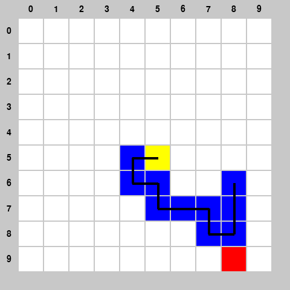

# SNAKE
This is a tool to simulate the classic game Snake and generate QA dataset, which contains images, questions and step-by-step CoT solutions.

An example game image:



## Rule
10x10 grid map, where red represents food, yellow represents the snake's head, and blue represents the snake's body. The snake head cannot touch the map boundary or the snake's body, otherwise the game ends.

## Question
1. Snake head postion
2. Food postion
3. Snake length
4. What will happen until this process ends if following a specific sequence of moves (hitting its own body, hitting the wall, reaching the food, or nothing else happens)?
5. The shortest path to reach the food

## How to use
### requirements
python version: 3.8.18
numpy 1.24.4
pygame 2.6.1

You can run `pip install numpy==1.24.4 pygame==2.6.1`.

### How to run code
Just run `python gen_qa.py`.

## Text-Only QA Conversion

To convert this game's multimodal QA data into a text-only version, run the unified converter from the repository root:

```bash
python src/Code_for_text_data_derivative/convert_text_data.py --game snake --data src/snake/snake_dataset_example/data.json --output src/snake/snake_dataset_example/data_text.json
```

The converter reads each entry's `state` JSON, prepends a textual description of the visible game state to the original question, and writes `data_text.json` without the `image` or `state` fields by default.

Example text state fragment:

```text
SNAKE STATE:
Grid: .=empty, H=snake head, B=snake body, F=food. Coordinates use row and column from the top-left.
. . . . . . . . . .
. . . . . . . . . .
. . . . . . . . . .
. . . . . . . . . .
. . . . . . . . . .
. . . . B H . . . .
. . . . B B . . B .
. . . . . B B B B .
. . . . . . . B B .
. . . . . . . . F .
```
