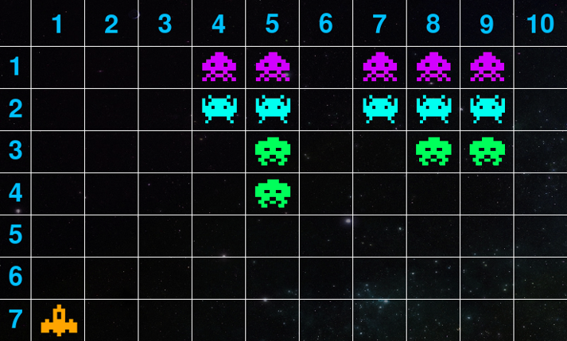

# Space Invaders Dataset Generator

This project generates a visual question answering (VQA) dataset based on the classic game Space Invaders. The dataset consists of various game states and corresponding questions that test both perception and strategic reasoning abilities.

An example game image:



## Quick Start

### Installation
```bash
pip install -r requirements.txt
```

### Usage
```bash
cd space_invaders
```

Generate the dataset using main.py:

```bash
python main.py --num-qa NUM_QA [--scene-level-dist EASY MED HARD] [--output-dir DIR] [--cover-exist]
```

Arguments:
- `--num-qa`: Number of QA pairs to generate (required)
- `--scene-level-dist`: Distribution ratios of Easy:Medium:Hard difficulty levels (default: 5 3 2)
- `--output-dir`: Output directory path (default: 'space_invaders_dataset')
- `--cover-exist`: Whether to overwrite existing output directory

Example:
```bash
python main.py --num-qa 900 --scene-level-dist 5 3 2 --output-dir space_invaders_dataset
```

This will generate:
- `images/`: PNG files of game scenes
- `states/`: JSON files containing game state information
- `fill_dataset.json`: Questions requiring numeric answers
- `mcq_dataset.json`: Multiple-choice questions
- `data.json`: Combined dataset

## Game Description

### Basic Rules
- A ship at the bottom can move horizontally and shoot lasers upward
- Enemies are initially arranged in a matrix formation (enemy_rows × enemy_cols)
- Enemies move uniformly either left or right
- Different enemies have different point values when destroyed:
  - Purple enemies: 30 points
  - Blue enemies: 20 points
  - Green enemies: 10 points

### Simplified Game Interface
- The enemy area is divided into a grid with numbered rows and columns
- Each cell is either empty or contains an enemy (purple, blue, or green)
- The ship is aligned with a column at the bottom
- When shooting, only the lowermost enemy in the same column can be destroyed

### Time Sequence Rules
- Time is discretized into intervals (t, t+1, t+2, ...)
- During each interval t:
  1. The ship can move to any column
  2. The ship can shoot at most once
  3. Enemies remain stationary
- At the end of each interval, enemies move one step in their current direction

## Question Types

### State Information
1. Count enemies in a specific row/column
2. Count total number of enemies
3. Count enemies of a specific color
4. Calculate points from shooting at current position

### Action Outcomes
1. Calculate points from moving to a specific column and shooting
2. Calculate total points from continuous shooting while enemies move

### Strategy Optimization
1. Find maximum points possible from one shot
2. Find maximum points possible from two shots

## Text-Only QA Conversion

To convert this game's multimodal QA data into a text-only version, run the unified converter from the repository root:

```bash
python src/Code_for_text_data_derivative/convert_text_data.py --game space_invaders --data src/space_invaders/space_invaders_dataset_example/data.json --output src/space_invaders/space_invaders_dataset_example/data_text.json
```

The converter reads each entry's `state` JSON, prepends a textual description of the visible game state to the original question, and writes `data_text.json` without the `image` or `state` fields by default.

Example text state fragment:

```text
SPACE INVADERS STATE:
Enemy area: rows 1-6, columns 1-10. Ship column: 1.
Grid entries are enemy colors; '.' means no enemy:
Row 1: ['.', '.', '.', 'purple', 'purple', '.', 'purple', 'purple', 'purple', '.']
Row 2: ['.', '.', '.', 'blue', 'blue', '.', 'blue', 'blue', 'blue', '.']
Row 3: ['.', '.', '.', '.', 'green', '.', '.', 'green', 'green', '.']
Row 4: ['.', '.', '.', '.', 'green', '.', '.', '.', '.', '.']
Row 5: ['.', '.', '.', '.', '.', '.', '.', '.', '.', '.']
Row 6: ['.', '.', '.', '.', '.', '.', '.', '.', '.', '.']
```
