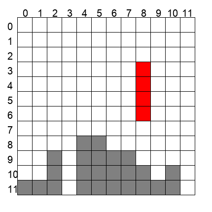

# Tetris VQA Dataset Generator

**Tetris VQA Dataset Generator** is a tool designed to simulate the classic game **Tetris** and generate a comprehensive Visual Question Answering (VQA) dataset. It creates game state images featuring various Tetris board configurations with active and placed tetrominoes. Based on these images, it generates different types of questions ranging from simple state recognition to complex strategy optimization. The generated VQA dataset includes game images, states, questions, answers, and detailed analyses, making it suitable for training multimodal models.

An example game image:



## Features

- **Dynamic Grid Sizes**: Supports multiple grid sizes (8x8, 12x12, 16x16) for varying difficulty levels
- **Realistic Tetris Simulation**: Accurately simulates Tetris game mechanics including piece placement and rotation
- **Multiple Question Types**: Generates diverse question types from simple state information to complex strategy optimization
- **Detailed Analysis**: Provides comprehensive explanations for each answer
- **Customizable Generation**: Flexible parameters for controlling dataset size and complexity

## Game Rules

1. Tetris is a classic puzzle game where players arrange geometric shapes (Tetrominoes) falling from the top of a grid.
2. Tetrominoes can be moved left/right and rotated as they fall.
3. When a Tetromino lands, it becomes fixed in place.
4. When a horizontal row is completely filled, it gets cleared.
5. The game continues until pieces stack up to the top of the grid.

## Project Structure

- `main.py`: Main script for dataset generation with parameter handling
- `Grid.py`: Core Tetris grid implementation and game mechanics
- `img_generator.py`: Handles generation of game state images
- `qa_generator.py`: Generates various types of questions and answers

## Output Contents

The generator creates a structured dataset in the specified output directory:
```
tetris_dataset/
├── images/             # PNG images of game states
├── states/            # JSON files containing game state data
└── data.json       # Complete dataset with QA pairs
```

## Supported Question Types

### 1. Target Perception
- Empty cell counting in specified rows
- Active Tetromino shape recognition

### 2. State Prediction
- Collision timesteps prediction after one-step movements

### 3. Strategy Optimization
- Maximum clearable rows optimization

## Usage

### Prerequisites
```bash
pip install numpy pillow
```

### Running the Generator
Basic usage:
```bash
python main.py
```

With custom parameters:
```bash
python main.py --num_grids=4 --min_move=10  --max_moves=20 --output_dir="tetris_dataset_example"
```

### Parameters

- `num_grids`: Number of grids to generate for each size and move count (default: 10)
- `output_dir`: Output directory for the dataset (default: "tetris_dataset")
- `min_moves`: Minimum number of moves to simulate (default: 10), better set larger to avoid too many space in the grids, which may cause too many answers to be zero
- `max_moves`: Maximum number of moves to simulate (default: 20)

### Import Usage

You can also use the generator in your Python code:
```python
from main import generate_datasets

# Generate dataset with custom parameters
mcq_dataset, fill_dataset = generate_datasets(
    num_grids=20,
    output_dir="custom_dataset",
    moves_range=(10, 20)
)
```

### Grid Size Configuration

The generator supports three grid sizes:
- 8x8 (Easy)
- 12x12 (Medium)
- 16x16 (Hard)

You can modify the `GRID_SIZES` list in `main.py` to adjust available grid sizes:
```python
GRID_SIZES = [8, 12, 16]  # Modify this list to change available grid sizes
```

### Question Type Distribution

The dataset is evenly split between three question types (`QA_TYPE_NUMS = 3`). You can adjust this distribution by modifying the chunk size calculation in the `generate_datasets` function.

## Text-Only QA Conversion

To convert this game's multimodal QA data into a text-only version, run the unified converter from the repository root:

```bash
python src/Code_for_text_data_derivative/convert_text_data.py --game tetris --data src/tetris/tetris_dataset_example/data.json --output src/tetris/tetris_dataset_example/data_text.json
```

The converter reads each entry's `state` JSON, prepends a textual description of the visible game state to the original question, and writes `data_text.json` without the `image` or `state` fields by default.

Example text state fragment:

```text
TETRIS STATE:
Grid size: 12 rows x 12 columns.
Board grid, where 0 usually means empty and nonzero values mean occupied/color cells:
Row 0: [0.0, 0.0, 0.0, 0.0, 0.0, 0.0, 0.0, 0.0, 0.0, 0.0, 0.0, 0.0]
Row 1: [0.0, 0.0, 0.0, 0.0, 0.0, 0.0, 0.0, 0.0, 0.0, 0.0, 0.0, 0.0]
Row 2: [0.0, 0.0, 0.0, 0.0, 0.0, 0.0, 0.0, 0.0, 0.0, 0.0, 0.0, 0.0]
Row 3: [0.0, 0.0, 0.0, 0.0, 0.0, 0.0, 0.0, 0.0, 2.0, 0.0, 0.0, 0.0]
Row 4: [0.0, 0.0, 0.0, 0.0, 0.0, 0.0, 0.0, 0.0, 2.0, 0.0, 0.0, 0.0]
Row 5: [0.0, 0.0, 0.0, 0.0, 0.0, 0.0, 0.0, 0.0, 2.0, 0.0, 0.0, 0.0]
Row 6: [0.0, 0.0, 0.0, 0.0, 0.0, 0.0, 0.0, 0.0, 2.0, 0.0, 0.0, 0.0]
Row 7: [0.0, 0.0, 0.0, 0.0, 0.0, 0.0, 0.0, 0.0, 0.0, 0.0, 0.0, 0.0]
Row 8: [0.0, 0.0, 0.0, 0.0, 1.0, 1.0, 0.0, 0.0, 0.0, 0.0, 0.0, 0.0]
Row 9: [0.0, 0.0, 1.0, 0.0, 1.0, 1.0, 1.0, 1.0, 0.0, 0.0, 0.0, 0.0]
Row 10: [0.0, 0.0, 1.0, 0.0, 1.0, 1.0, 1.0, 1.0, 1.0, 0.0, 1.0, 0.0]
Row 11: [1.0, 1.0, 1.0, 0.0, 1.0, 1.0, 1.0, 1.0, 1.0, 1.0, 1.0, 0.0]
```
