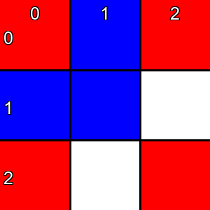

# Tic-Tac-Toe VQA Dataset Generator

## Overview

The **Tic-Tac-Toe VQA Dataset Generator** is a tool designed to simulate the classic game of **Tic-Tac-Toe** and generate a comprehensive Visual Question Answering (VQA) dataset. This tool creates game images featuring various states of the Tic-Tac-Toe board and generates different types of questions based on these images. The generated VQA dataset includes game images, questions, answers, and detailed analyses, making it suitable for training multimodal models.

An example game image:



### Dataset Contents:

- **Images**: Visual representations of the Tic-Tac-Toe board at different states.
- **States**: JSON files containing the board state, including player moves and game progress.
- **Questions & Answers**: A variety of questions related to the game state, optimal moves, and potential outcomes.

## Game Rules

Tic-Tac-Toe is a classic two-player game played on a 3x3 grid, (row, col) from (0, 0) to (2, 2). Players take turns marking a space in the grid, one using **O** and the other using **X**. In each game, player **O** starts first. The objective is to be the first to get three of your marks in a row (horizontally, vertically, or diagonally). If all nine squares are filled without either player achieving this, the game ends in a draw.

## Project Structure

```
tictactoe_dataset/
├── images/                  # Directory containing generated board images
│   ├── board_1.png
│   ├── board_2.png
│   └── ...
├── states/                  # Directory containing JSON files of board states
│   ├── board_1.json
│   ├── board_2.json
│   └── ...
└── mcq_dataset.json         # Generated VQA dataset in JSON format
```

### File Descriptions:

- **images/**: Contains PNG images of the Tic-Tac-Toe board at various states.
- **states/**: Contains JSON files representing the board state, including player moves and game progress.
- **mcq_dataset.json**: The main dataset file containing questions, answers, and metadata.

## Supported Question Types

The dataset includes questions categorized into the following types:

1. **Target Perception**: Questions about the current state of the board.
   - Example: *"What is the color of the block at row 0, column 1?"*
2. **State Prediction**: Questions about the outcome of a specific move.
   - Example: *"What is the optimal move for the current player?"*
3. **Strategy Optimization**: Questions about selecting the best long-term move.
    - Example: *"What is the best move to maximize the chance of winning from this board state?"*

## How to Use

### 1. Install Dependencies

Ensure you have the following dependencies installed:

- Python 3.x
- `tkinter` (usually included with Python)
- `Pillow==10.2.0` (for generating board images)

Install the required packages using:

```
pip install -r requirements.txt
```

### 2. Run the Script

To generate the dataset, run the following command:

```
python main.py --num 100
```

- `--num`: Specifies the number of board states to generate (default is `10`).

### 3. Output Files

- **Board Images**: Saved in the `tictactoe_dataset/images/` directory.
- **Board States**: Saved in the `tictactoe_dataset/states/` directory.
- **VQA Dataset**: Saved as `tictactoe_dataset/mcq_dataset.json`.

### 4. Dataset Format

The `mcq_dataset.json` file contains the following fields for each question:

- `data_id`: Unique identifier for the question.
- `qa_type`: Type of question (`Target Perception`, `State Prediction`, `Strategy Optimization`).
- `question_id`: Number for qa_type.
- `question_description`: Description of the question type.
- `image`: Path to the corresponding board image.
- `state`: Path to the corresponding board state JSON file.
- `plot_level`: Difficulty level of the board state (`Easy`, `Medium`, `Hard`).
- `qa_level`: Difficulty level of the question (`Easy`, `Medium`, `Hard`).
- `question`: The question text.
- `answer`: The correct answer to the question.
- `analysis`: Detailed analysis of the question.
- `options`: List of possible answers.

### Example Dataset Entry

```json
    {
        "data_id": "tictactoe-mcq-6-StrategyOptimization",
        "qa_type": "Strategy Optimization",
        "question_id": 2,
        "question_description": "Questions about the optimal strategy to take a move of the current player of the board.",
        "image": "images/board_6.png",
        "state": "states/board_6.json",
        "plot_level": "Easy",
        "qa_level": "Medium",
        "question": "Principles: Tic-Tac-Toe is a classic two-player game played on a 3x3 grid, (row, col) from (0, 0) to (2, 2). Players take turns marking a space in the grid, one using **O** (the red block) and the other using **X** (the blue block). In each game, player **O** starts first. The objective is to be the first to get three of your marks in a row (horizontally, vertically, or diagonally). If all nine squares are filled without either player achieving this, the game ends in a draw. Notice: the current player to make a move should be inferred from the number of pieces for each players on the board. When inferring the optimal move, if optimal move can be inferred by some rules, choose the optimal move. Otherwise, choose the first move. (The order of choices is (0, 0), (0, 1), (0, 2), (1, 0), ..., (2, 2), choose the first move that is not occupied)\n\nQuestion: What is the optimal move for the current player? If no move exists, choose the answer \"None\".\n\nOptions: ['A.None', 'B.(0, 0)', 'C.(0, 1)', 'D.(0, 2)', 'E.(1, 0)', 'F.(1, 1)', 'G.(1, 2)', 'H.(2, 0) or (2, 1) or (2, 2)']",
        "answer": "G",
        "analysis": "The current board is [['O', 'X', 'O'], ['X', 'X', ' '], ['O', ' ', 'O']]. Since the player \"O\" plays first in each game, if the count of \"O\" is the same as \"X\", the current player is \"O\". Otherwise, the current player is \"X\". The count of \"O\" is 4 and the count of \"X\" is 3, so the player now is X. Current player is X, opponent is O. Player X can win on Row 1, so player X should choose position (1, 2).",
        "options": [
            "A.None",
            "B.(0, 0)",
            "C.(0, 1)",
            "D.(0, 2)",
            "E.(1, 0)",
            "F.(1, 1)",
            "G.(1, 2)",
            "H.(2, 0) or (2, 1) or (2, 2)"
        ]
    },
```

## Additional Notes

The recommendations for the Tic-Tac-Toe analysis provided in the data are based on the following rules:
(Executed sequentially; if the preceding condition is not met, the subsequent one is executed.)

1. If the current player can win immediately, choose the corresponding position.
2. If the opponent can win immediately, choose the corresponding position to block. (If the opponent has multiple immediate winning options, they cannot all be blocked, so no rule applies and the first empty position is chosen as in rule 5; "None" is only the answer when a move fails or wins immediately.)
3. If the current player can create a "double threat" (after placing a piece, there are two rows/columns/diagonals each with two of the current player's pieces and no opponent's pieces, meaning the current player is guaranteed to win), choose the corresponding position.
4. If the opponent can create a "double threat", block the corresponding position.
5. Choose the first empty position from `(0, 0)` to `(2, 2)`.

## Text-Only QA Conversion

To convert this game's multimodal QA data into a text-only version, run the unified converter from the repository root:

```bash
python src/Code_for_text_data_derivative/convert_text_data.py --game tictactoe --data src/tictactoe/tictactoe_dataset_example/data.json --output src/tictactoe/tictactoe_dataset_example/data_text.json
```

The converter reads each entry's `state` JSON, prepends a textual description of the visible game state to the original question, and writes `data_text.json` without the `image` or `state` fields by default.

Example text state fragment:

```text
TICTACTOE STATE:
Board:
Row 0: ['O', 'X', 'O']
Row 1: ['X', 'X', ' ']
Row 2: ['O', ' ', 'O']
```

## License

This project is licensed under the **MIT License**. See the [LICENSE](https://chat.deepseek.com/a/chat/s/LICENSE) file for more details.

