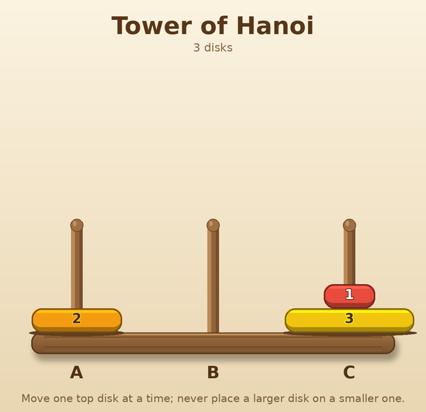

# Tower of Hanoi VQA Dataset Generator

Generates a multimodal GameQA dataset from legal mid-game configurations of
the classic three-peg Tower of Hanoi puzzle. The dataset combines visual stack
reading, forward and inverse state reasoning, and exact shortest-path planning.
All answers and analyses are produced from the machine-readable board state.



## Features

- Three visual difficulty levels: 3 disks for Easy, 4 for Medium, and 5 for
  Hard, with five images at each level.
- 15 deterministic example boards and 60 QA entries: one entry for each of the
  four task templates on every board.
- Rich 600x580 PIL rendering with a parchment background, shaded wooden pegs,
  a rounded wooden base, and consistently colored, numbered disks.
- Forward move traces explicitly identify and skip illegal moves; planning
  questions use exact breadth-first search rather than a heuristic.
- Every question includes 4-8 unique options, a 1-based answer index, and a
  concrete step-by-step analysis.
- `verify.py` independently parses every question, re-simulates its moves, and
  recomputes shortest paths with a disk-indexed state representation that is
  separate from the generator's solver.

## Game Rules

- Pegs A, B, and C appear from left to right.
- Disk 1 is the smallest; a larger size number denotes a wider disk.
- A stack is read from bottom to top. Only the top disk of a peg may move.
- A disk may move to an empty peg or onto a larger disk. A larger disk may
  never be placed on a smaller disk.
- A move written `A → C` means to move the current top disk of peg A to peg C.
  In task 2, an illegal move is skipped and leaves the board unchanged.

## Project Structure

```
src/tower_of_hanoi/
├── README.md
├── requirements.txt
├── main.py                         # deterministic dataset generator
├── tower_of_hanoi.py               # game logic, renderer, QA builders
├── verify.py                       # independent answer checker
├── test_tower_of_hanoi.py          # renderer and pipeline regressions
└── tower_of_hanoi_dataset_example/
    ├── data.json                   # 60 QA entries
    ├── images/                     # board_00001.png ... board_00015.png
    └── states/                     # board_00001.json ... board_00015.json
```

Each state stores the disk count, the three bottom-to-top peg stacks, the
planning target peg, and the legal scramble used to obtain the shown state.

## Supported Question Types

- **Target Perception** (`qa_level: Easy`, `question_id: 1`) — count disks,
  identify a top disk, locate the largest disk, or list a stack bottom-to-top.
- **State Prediction** (`qa_level: Medium`, `question_id: 2`) — apply a sequence
  of 3-5 moves, skipping any illegal move, then predict a stack count or top
  disk.
- **State Prediction** (`qa_level: Hard`, `question_id: 3`) — infer the unique
  legal move that produces a described one-move outcome.
- **Strategy Optimization** (`qa_level: Hard`, `question_id: 4`) — compute the
  exact minimum moves needed to gather every disk on a target peg, or choose
  the strictly unique optimal first move of a shortest solution.

## Usage

Prerequisites:

```bash
pip install -r requirements.txt
```

Generate and verify the example dataset:

```bash
python main.py
python verify.py
```

`python main.py` replaces the generated `images/` and `states/` directories
and regenerates the complete output deterministically using seed `20260723`.
`python verify.py` exits non-zero on any schema, file, state, option, answer, or
analysis inconsistency and prints `ALL CHECKS PASSED` on success.

Run the regression suite with:

```bash
python -m unittest -v test_tower_of_hanoi.py
```

## License

MIT
