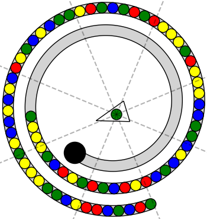

# Zuma QA Dataset Generator

This module generates QA data for a Zuma-style marble-shooting puzzle. The player controls a frog that shoots colored marbles toward a moving chain on a curved track. The goal is to clear marbles before they reach the black hole at the end of the track.

An example game image:



## Game Setup

- The frog is drawn as a triangle, and the colored circle on it is the next marble to be shot.
- Marbles move along the gray track toward the black hole.
- The dashed rays around the frog divide the scene into 8 directional regions used by some questions.
- Angles in the questions are measured from the frog center, with the positive x-axis as `0°`.

## Difficulty

Following the game design used in this repository, plot difficulty mainly depends on track length and marble count:

- `Easy`: shorter track with fewer marbles
- `Medium`: longer track with more marbles
- `Hard`: long and dense track with many marbles

## Supported Question Types

1. Next marble color
2. Count marbles of a given color on the track
3. Count same-color adjacent groups in a given direction
4. Determine which marble color is hit at a specified angle
5. Predict the shot result at a specified angle
6. Find the best one-step elimination strategy

These cover `Target Perception`, `State Prediction`, and `Strategy Optimization`.

## Files

- `gene_gamedata.py`: draws the track, frog, marbles, and saves `states/*.json`
- `gene_qa.py`: generates QA entries from each saved state
- `gene_dataset.py`: batch entry point

## How to Run

Install dependencies:

```bash
pip install matplotlib numpy
```

The current scripts write to relative paths `images/`, `states/`, and `data.json`, and they do not create these directories automatically. A reliable workflow is:

1. Create a working directory with empty `images/` and `states/`.
2. Place `gene_gamedata.py`, `gene_qa.py`, and `gene_dataset.py` in that directory.
3. Run:

```bash
python gene_dataset.py
```

To control dataset size, edit `dataset_size` in `gene_dataset.py`.

## Output

- `images/*.png`: rendered game scenes
- `states/*.json`: frog, track, hole, and marble positions/colors
- `data.json`: generated QA records

## Text-Only QA Conversion

To convert this game's multimodal QA data into a text-only version, run the unified converter from the repository root:

```bash
python src/Code_for_text_data_derivative/convert_text_data.py --game zuma --data src/zuma/zuma_dataset_example/data.json --output src/zuma/zuma_dataset_example/data_text.json
```

The converter reads each entry's `state` JSON, prepends a textual description of the visible game state to the original question, and writes `data_text.json` without the `image` or `state` fields by default.

Example text state fragment:

```text
ZUMA STATE:
Track: {'plot_level': 'Medium', 'hole_position': {'x': -1.9336408014512254, 'y': -2.7464934542910426}}
Balls on track: [{'position': {'x': 2.325093698074389, 'y': -5.6107475945526035}, 'color': 'green'}, {'position': {'x': 1.736756 ...
Frog/shooter: {'position': {'x': 0.4042746249648226, 'y': -0.5988457693062086}, 'angle': -163, 'next_ball_color': 'green', 'afte ...
```
